> 이 책은 Michael L. Scott - Programming Language Pragmatics을 번역 정리한 글입니다.

# 1. Introduction

최초의 전자 컴퓨터는 거대한 기계로 여러 개의 방을 가득 채우고, 공장만큼 전기를 소비했습니다. 1940년대에 수백만 달러의 비용이 들 정도였죠. 

이 기계를 사용한 프로그래머들은 기계어로 프로그래밍 했습니다. 기계어는 프로세스를 직접 제어하여 적절한 시간에 데이터를 한 장소에서 다른 곳으로 이동시키는 일련의 비트입니다. 이정도의 상세 수준에서 프로그램을 지정하는 것은 매우 지루한 작업입니다.

다음 프로그램은 GCD 알고리즘을 x86머신의 기계어로 작성한 것입니다.

```wasm
5589e553 83ec0483 e4f0e831 00000089 c3e82a00 000039c3 74108db6 00000000 39c37e13 29c339c3 75f6891c 24e86e00 00008b5d fcc9c329 d8ebeb90
```

사람들이 더 큰 프로그램을 쓰기 시작하면서, 실수할 확률이 적은 표기법이 필요했습니다.

`어셈블리어`는 연산이 니모닉 약어로 표현될 수 있도록 발명되었습니다. 당사의 GCD 프로그램은 x86 어셈블리어로 다음과 같습니다.

```
	pushl %ebp
	movl %esp, %ebp 
	pushl %ebx
	subl $4, %esp 
	andl $-16, %esp 
	call getint 
	movl %eax, %ebx 
	call getint 
	cmpl %eax, %ebx 
	je C
A:cmpl %eax, %ebx
	jle D
	subl %eax, %ebx 
B:cmpl %eax, %ebx
	jne A
C:movl %ebx, (%esp)
	call putint
	movl -4(%ebp), %ebx 
	leave
	ret
D:subl %ebx, %eax
	jmp B
```

어셈블리어는 원래 니모닉과 기계어 명령어 사이의 일대일 대응으로 설계되었습니다. 어셈블러는 결국 프로그래머들이 공통 명령어 시퀀스에 대한 매개변수화된 약어를 정의할 수 있도록 정교한 "매크로 확장" 기능을 갖추게 되었다. 

어셈블리어와 기계어 사이의 대응은 명확하고 명확했습니다. 프로그래밍은 기계 중심으로 기획되었습니다. 각각의 다른 종류의 컴퓨터는 그들만의 어셈블리 언어로 프로그래밍되어야 했고, 프로그래머들은 기계가 실제로 실행할 명령어에 대해 생각했습니다.

컴퓨터가 발전하고, 경쟁적인 디자인이 발전하는데, 모든 새로운 기계에 프로그램을 다시 작성해야 하는 것은 점점 더 힘들었습니다. 또한 대규모 어셈블리어 프로그램에서 인간이 세부 사항을 추적하는 것은 점점 더 어려워졌습니다.

사람들은 기계 독립 언어, 특히 수치 계산(당시 가장 흔한 프로그램 유형)이 수학 공식과 더 가까운 형태로 표현될 수 있는 언어를 원하기 시작했습니다. 이러한 바람은 1950년대 중반 최초의 고급 프로그래밍 언어인 포트란(Fortran)의 원조 방언의 개발로 이어졌습니다. 리스프와 알골 등 다른 고급 언어들도 곧 그 뒤를 이었습니다.

---

고급 언어에서 어셈블리어나 기계어로 번역하는 것은 `컴파일러`로 알려진 시스템 프로그램의 일입니다. 컴파일러는 소스가 고급 언어일 때 소스와 대상 연산 사이의 일대일 대응이 더 이상 존재하지 않기 때문에 어셈블러보다 더 복잡합니다.

프로그래머들은 어느 정도 노력만 하면 컴파일러가 만들 수 있는 것보다 더 빨리 실행될 수 있는 어셈블리 언어 프로그램을 거의 항상 작성할 수 있었기 때문에 포트란은 처음에는 인기가 없었습니다. 하지만 시간이 지나면서 격차가 좁혀졌고, 결국 역전됐죠. 

하드웨어의 복잡성 증가(파이프라인, 다중 기능 단위 등)와 컴파일러 기술의 지속적인 향상은 최첨단 컴파일러가 사람보다 더 나은 코드를 생성하는 상황을 초래했습니다. 인간이 더 잘할 수 있는 경우에도 컴퓨터 속도와 프로그램 크기의 증가로 인해 프로그램의 원래 구성뿐만 아니라 이후의 프로그램 유지 관리(향상 및 수정)에서 프로그래머의 노력을 절약하는 것이 점점 더 중요해졌습니다. 인건비가 컴퓨팅 하드웨어 비용을 훨씬 능가하기 때문입니다.

## 1.1 The Art of Language Design

오늘날 수천 개의 고급 프로그래밍 언어가 있으며 새로운 언어들이 계속해서 생겨나고 있습니다.

왜 이렇게 많을까요? 다음과 같은 몇 가지 답이 있을 수 있습니다.

**1. 진화**

컴퓨터 과학은 아직 초기 학문입니다. 우리는 일을 하기 위한 더 나은 방법을 끊임없이 찾고 있습니다. 

1960년대 후반과 1970년대 초반에는 `structured programming` 혁명이 일어나 포트란, 코볼, 베이직과 같은 언어에 의해 goto 기반 제어 흐름에서 루프, 케이스(스위치) 문, 그리고 이와 유사한 상위 수준의 구조체들로 발전했습니다.

1980년대 후반 알골, 파스칼, 에이다와 같은 언어들의 중첩된 블록 구조가 스몰토크, C++, 에펠과 같은 언어들의 객체 지향적 구조에 자리를 내주기 시작했습다.

최근에는 파이썬과 루비와 같은 스크립트 언어가 빠른 개발을 위해 전통적인 컴파일 언어를 대체하기 시작했습니다.

**2. 특수 용도**

일부 언어는 특정 문제 영역에 맞게 설계되었습니다. 

- 다양한 리스프 방언은 심볼 데이터와 컴플렉스 데이터 구조를 조작하는 데 좋습니다.
- Icon과 Awk는 문자열 조작에 좋습니다.
- C는 로우 레벨 시스템 프로그래밍에 좋습니다.
- 프롤로그는 데이터 간의 논리적 관계를 확인하는 데 좋습니다.

이 언어들은 각각 더 넓은 범위의 작업에도 사용될 수 있지만, 그 전문성에 중점을 두고 있습니다.

**3. 개인 선호도**

사람마다 좋아하는 것이 다릅니다. 프로그래밍의 편파주의의 많은 부분은 단순히 취향의 문제입니다. 

- 어떤 사람들은 C의 진부함을 좋아하고, 어떤 사람들은 그것을 싫어합니다.
- 어떤 사람들은 재귀적으로 생각하는 것이 당연하다고 생각하고, 다른 사람들은 반복하는 것을 선호합니다.
- 어떤 사람들은 포인터로 작업하기를 좋아하고, 다른 사람들은 리스프, 자바, ML의 암묵적인 비참조를 선호한다.

---

그러나 디자인된 많은 것들 중에서 단지 수십 개만이 널리 사용되고 있습니다.

무엇이 언어를 성공적으로 만들까요? 다시 몇 가지 답이 있습니다.

**1. 표현력**

언어 기능은 특히 매우 큰 시스템의 경우 명확하고 간결하며 유지관리 가능한 코드를 작성하는 프로그래머의 능력에 큰 영향을 미칩니다. 예를 들어, 초기 버전의 베이직과 C++ 는 비교 불가능할 정도로 기능적 차이가 있습니다.. 표현력에 기여하는 요소들, 특히 추상화 기능이 이 책의 주요 초점입니다.

**2. 초보자를 위한 사용 편의성**

베이직은 트집 잡기는 쉽지만, 성공을 부정할 수는 없습니다. 그 성공의 일부는 그것의 매우 낮은 "학습 곡선" 때문이었습니다. 

파스칼은 여러 해 동안 프로그래밍 언어 입문 강좌에서 가르쳤는데, 그 이유는 적어도 다른 진지한 언어들에 비해 간결하고 배우기 쉬웠기 때문입니다. 세기가 바뀐 직후, 자바가 비슷한 역할을 하게 되었습니다. 자바는 파스칼보다 훨씬 복잡하지만, C++보다 간단합니다. 단순성에 대한 새로운 추구로, 최근 몇 년 동안 일부 입문 과정은 파이썬과 같은 스크립트 언어로 바뀌었습니다.

**3. 구현 용이성**

베이직은 낮은 학습 곡선뿐만 아니라 제한된 리소스로 작은 기계에서 쉽게 구현할 수 있었기 때문에 성공적이었습니다. 파스칼의 성공에 있어 가장 중요한 한 가지 요인은 파스칼의 디자이너인 니클라우스 워스가 파스칼 언어를 간단하고 휴대할 수 있는 구현체를 개발하여 전 세계 대학에 무료로 제공했다는 것입니다. 

자바와 파이썬 디자이너들은 그들의 언어를 원하는 거의 모든 사람들에게 무료로 제공하기 위해 비슷한 조치를 취했습니다.

**4. 표준화**

널리 사용되는 거의 모든 언어는 공식적인 국제 표준이나 (여러 스크립팅 언어의 경우) 하나의 표준 구현체를 가지고 있습니다. 언어와 광범위한 라이브러리 모두의 표준화는 플랫폼 간 코드의 이식성을 보장하기 위한 진정으로 효과적인 유일한 방법입니다. 

상대적으로 피폐한 것이 파스칼의 표준인데, 파스칼은 많은 프로그래머들에 의해 필수적인 기능들(별도 컴파일, 문자열, 정적 초기화, 랜덤 액세스 I/O)이 빠져있었고, 적어도 1980년대에 파스칼이 선호하던 언어의 하락에 부분적으로 책임이 있었습니다. 이러한 기능들 중 다수는 벤더마다 다른 방식으로 구현되었습니다.

**5. 오픈 소스**

오늘날 대부분의 프로그래밍 언어들은 적어도 하나의 오픈 소스 컴파일러나 인터프리터를 가지고 있지만, 일부 언어들, 특히 C는 자유롭게 배포되고 검토되고 커뮤니티 지원 컴퓨팅과 훨씬 더 밀접하게 연관되어 있습니다.

C는 원래 1970년대 초 벨 연구소의 데니스 리치와 켄 톰슨이 오리지널 유닉스 운영 체제의 디자인과 함께 개발하였다. 수년간 유닉스는 세계에서 가장 휴대성이 좋은 운영 체제(학술적인 컴퓨터 과학을 위한 OS)로 발전하였으며, C는 이와 밀접한 관련이 있었습니다. C의 표준화와 함께 이 언어는 다양한 추가 플랫폼에서 사용할 수 있게 되었습니다. 주요 오픈 소스 운영 체제인 리눅스는 C로 작성되어 있습니다. 2015년 6월 현재 C와 그 후손들은 웹 페이지 참조, 도서 판매, 고용 목록, 오픈 소스 리포지토리 업데이트 등 다양한 언어 관련 온라인 콘텐츠의 절반 이상을 차지하고 있습니다.

**6. 좋은 컴파일러**

포트란이 성공한 것은 매우 우수한 컴파일러 덕분입니다. 부분적으로는 이것은 역사적 사고의 문제인데요. 포트란은 다른 무엇보다도 오래 존재했고, 회사들은 매우 빠른 코드를 생성하는 컴파일러를 만들기 위해 막대한 시간과 돈을 투자했습니다.

그러나 언어 디자인의 문제이기도 합니다. 포트란 90 이전의 포트란 방언에는 빠른 코드를 생성하는 작업을 훨씬 복잡하게 만드는 재귀와 포인터가 없었습니다. 비슷한 맥락에서 일부 언어들(예: Common Lisp)은 프로그래머가 매우 큰 프로젝트를 관리할 수 있도록 도와주는 컴파일러와 지원 도구를 가지고 있기 때문에 부분적으로 성공을 거두었습니다

**7. 경제, 후원, 그리고 이너시아**

마지막으로 기술적 장점 외에도 성공에 큰 영향을 미치는 요소들이 있습니다. 강력한 후원자의 후원이 그 하나입니다. PL/I는 IBM에 의해 수명이 연장되었습니다. 코볼과 에이다는 미국 국방부에, C#는 마이크로소프트의 덕분에 성공을 이루었습니다.

최근 몇 년 동안, Objective-C는 아이폰과 아이패드 앱의 공식 언어로 엄청난 인기를 누리고 있습니다. 라이프 사이클의 다른 한편에서는, 어떤 언어들은 설치 소프트웨어와 프로그래머 전문지식의 거대한 기반 때문에 더 나은 대안이 나온 후에도 오랫동안 널리 사용되고 있습니다. 예를 들어, 세계 금융 인프라의 대부분은 여전히 주로 코볼에서 작동합니다.

분명히 언어가 "좋은"지 여부를 결정하는 단일 요소는 없습니다. 프로그래밍 언어를 연구할 때, 우리는 몇 가지 관점에서 문제를 고려해야 합니다. 특히, 우리는 프로그래머와 언어 구현자 모두의 관점을 고려할 필요가 있습니다. 

때로는 실행 속도를 원하는 것처럼 이러한 관점이 조화를 이룰 것입니다. 그러나 기능의 개념적 매력이 구현 비용과 균형을 이루므로 종종 충돌과 절충이 있을 수 있습니다.

---

컴퓨팅 초기에는 시행자의 관점이 우세했습니다. 프로그래밍 언어는 컴퓨터에 무엇을 해야 하는지 알려주는 수단으로 발전했습니다. 그러나 프로그래머들에게 언어는 알고리즘을 표현하는 수단으로 더 적절하게 정의됩니다. 

자연어가 설명과 담론을 제약하듯이 프로그래밍 언어는 표현 가능한 것과 표현 불가능한 것을 제약하고 프로그래머가 생각할 수 있는 것에 심오하고 미묘한 영향을 미칩니다. Donald Knuth는 프로그래밍을 다른 인간에게 컴퓨터가 무엇을 하기를 원하는지 알려주는 예술로 간주해야 한다고 제안했습니다. 이 정의는 아마도 가장 좋은 종류의 타협을 할 것이다. `개념적 명확성`과 `실행 효율성` 모두 근본적인 관심사라는 것을 인정합니다. 이 책은 다루는 각각의 주제들의 개념적 측면과 실행적 측면을 동시에 고려함으로써 이러한 타협 정신을 포착하려고 시도할 것입니다.

Figure 1.1 프로그래밍 언어의 분류

- Declarative
    - functional
        - Lisp/Scheme, ML, Haskell
    - dataflow
        - Id, Val
    - logic, constraint-based
        - Prolog, spreadsheets, SQL
- Imperative
    - von Neumann
        - C, Ada, Fortran
    - object-oriented
        - Smalltalk, Eiffel, Java
    - scripting
        - Perl, Python, PHP

## 1.2 The Programming Language Spectrum

현존하는 많은 언어들은 그들의 계산 모델에 따라 어족으로 분류될 수 있습니다. Figure 1.1은 공통의 가족 집합을 보여줍니다.

최상위 분류는 컴퓨터가 해야 할 일에 초점을 맞추는 선언형 언어와 컴퓨터가 어떻게 해야 하는지에 초점을 맞추는 명령형 언어로 구분됩니다. 
선언형 언어는 명령형 언어보다 고수준이며, 프로그래머의 관점과 더 일치하지만 실행자의 관점과는 덜 일치합니다. 명령형 언어는 주로 성능상로 우세합니다. 

선언형 언어의 설계에는 "관련없는" 구현 세부 사항에서 벗어나고자 하는 욕구와 최소한 알고리즘의 개요를 제어하기 위해 세부 사항에 충분히 가까이 있어야 할 필요성 사이에 긴장감이 있습니다. 효율적인 알고리즘의 설계는 결국 컴퓨터 과학의 많은 부분에 관한 것입니다.

어떤 문제 영역에서는 컴파일러들이 매우 높은 수준의 추상화에서 언급된 문제에 대한 좋은 알고리즘을 발견하기를 기대할 수 있습니다. 그러나 컴파일러가 좋은 알고리즘을 찾을 수 없는 도메인에서 프로그래머는 명시적으로 알고리즘을 지정할 수 있어야 합니다.
선언적 어족 및 명령적 어족에는 몇 가지 중요한 하위 어족들이 있습니다.

- **함수형 언어**는 함수의 재귀적 정의에 기초한 계산 모델을 사용합니다. 그들은 1930년대에 알론조 교회가 개발한 형식적인 계산 모델인 람다 미적분학에서 영감을 얻었습니다. 본질적으로 프로그램은 입력에서 출력까지의 함수로 간주되며, 정제 과정을 통해 단순한 함수로 정의됩니다. 이 범주의 언어에는 Lisp, ML 및 Haskell이 포함됩니다.
- **데이터 흐름 언어**는 원시 함수 노드 간의 정보 흐름(토큰)으로 계산을 모델링합니다. 노드는 입력 토큰의 도착에 의해 트리거되며 동시에 작동할 수 있습니다. Id와 Val은 데이터 흐름 언어의 예입니다. Val의 후손인 Sisal은 함수형 언어로 더 자주 묘사됩니다.
- **논리 또는 제약 기반 언어**는 술어 논리로부터 영감을 받았습니다. 그들은 논리 규칙 목록을 통한 목표 지향 검색을 사용하여 특정 특정 관계를 만족시키는 값을 찾기 위한 시도로 계산을 모델링합니다. 프롤로그는 가장 잘 알려진 논리 언어입니다. 이 용어는 SQL 데이터베이스 언어, XSLT 스크립트 언어, 그리고 엑셀과 그 이전 버전들과 같은 스프레드시트의 프로그래밍 가능한 측면에도 적용됩니다.
- **폰 노이만어**는 아마도 가장 친숙하고 널리 사용되는 언어일 것입니다. 여기에는 포트란, 에이다, C 및 기본적인 연산 수단이 변수의 수정인 다른 모든 항목이 포함됩니다. 함수형 언어가 값을 갖는 표현에 기반을 두는 반면, 폰 노이만 언어는 기억의 값을 바꾸는 side effect*를* 통해 후속 계산에 영향을 미치는 문장(특히 할당)에 기초합니다.
- **객체 지향 언어**는 그 기원이 시물라 67에 있다. 대부분은 폰 노이만어와 밀접한 관련이 있지만, 훨씬 더 구조적이고 분산적인 기억과 계산 모델을 가지고 있습니다. 객체 지향 언어들은 단일 메모리 상에서 단일 프로세서의 연산으로 연산을 하기보다는 반의존 객체들 간의 상호작용으로 계산을 하며, 각각은 그 상태를 관리하기 위한 자체 내부 상태와 서브루틴을 모두 가지고 있습니다. 스몰토크는 객체 지향 언어 중 가장 순수하며, C++와 자바가 가장 널리 사용됩니다. 객체 지향 함수형 언어(CLOS [Kee89]와 OCaml로 가장 잘 알려져 있음)를 고안하는 것도 가능하지만 명령적인 경향이 강하게 있습니다.
- **스크립트 언어**는 몇몇 주변 문맥에서 추출한 구성 요소를 조정하거나 "접착"하는 것에 중점을 두는 것으로 구별됩니다. csh와 bash는 작업 제어(쉘) 프로그램의 입력 언어입니다; PHP와 자바스크립트는 주로 동적 웹 콘텐츠 생성을 위한 것입니다; Lua는 컴퓨터 게임을 제어하기 위해 널리 사용됩니다. 펄, 파이썬, 루비를 포함한 다른 언어들은 더 범용적입니다. 대부분은 신속한 프로토타이핑을 강조하며, 실행 속도보다 표현이 쉬운 편입니다.

어떤 사람은 병렬 언어가 별개의 어족을 형성할 것이라고 생각할 수도 있지만, 동시 실행과 순차 실행의 구분은 위의 분류와는 거의 무관합니다. 대부분의 병렬 프로그램들은 포트란이나 C와 같은 순차적 언어와 함께 특별한 라이브러리 패키지나 컴파일러를 사용하여 작성됩니다. 자바, C#, 에이다를 포함하여 널리 사용되는 몇몇 언어에는 명시적으로 동시 기능이 있습니다. 연구자들은 여기에 언급된 각 어족들의 동시성을 조사하고 있습니다.

어족 간의 대조를 보여주는 간단한 예로서, 이 장의 시작 부분에 소개된 최대공약수(GCD) 문제를 고려해봅시다. 이 문제에 대한 폰 노이만, 함수형, 논리형 프로그래밍의 선택은 코드의 모양뿐만 아니라 프로그래머의 사고방식에도 영향을 미칩니다. 폰 노이만 알고리즘 버전은 매우 중요합니다.

**GCD function in C: 폰노이만**

a와 b의 gcd를 계산하려면 a와 b가 같은지 확인하십시오. 만약 그렇다면, 그것들 중 하나를 인쇄하고 멈추세요. 그렇지 않으면 큰 수를 두 수의 차이로 교체하고 반복합니다.

```c
int gcd(int a, int b) { 
	while (a != b) {
		if (a > b) a = a - b;
		else b = b - a; 
	}
	return a; 
}
```

**GCD function in OCaml: 함수형**

a와 b의 gcd는 

1. a와 b가 같을 때 a
2. a > b일 때 b와 a - b의 gcd
3. b > a일 때 a와 b - a의 gcd로 정의된다. 

주어진 숫자의 gcd를 계산하려면 이 정의가 끝날 때까지 확장 및 단순화하십시오.

```ocaml
let recgcdab= 
	if a = b then a
	else if a > b then gcd b (a - b) 
		else gcd a (b - a)
```

**GCD rules in Prolog: 논리**

논리 언어에서 프로그래머는 시스템이 원하는 값을 찾을 수 있는 일련의 공리와 증명 규칙을 지정합니다.

다음과 같은 경우 명제 gcd(a, b, g)는 참이다.
(1) a, b, g는 모두 동일하다;
(2) a는 b보다 크고 c는 a - b이고 gcd(c, b, g)가 참인 숫자 c가 존재한다.
(3) a는 b보다 작으며 c는 b - a이고 gcd(c, a, g)가 참인 숫자 c가 존재한다.

주어진 숫자의 gcd를 계산하기 위해서, 이 규칙들이 gcd(a, b, g)가 참이라는 것을 증명할 수 있는 숫자 g를 찾아라.

```prolog
gcd(A,B,G) :- A = B, G = A.
gcd(A,B,G) :- A > B, C is A-B, gcd(C,B,G).
gcd(A,B,G) :- B > A, C is B-A, gcd(C,A,G).
```

:-를 if, 쉼표를 and로 읽으면 더 이해하기 쉽습니다.

어족 간의 구분이 명확하지 않다는 점을 강조하고 싶습니다. 예를 들어, 폰 노이만과 객체 지향 언어 사이의 구분은 종종 매우 모호하며, 많은 스크립트 언어도 객체 지향적입니다. 대부분의 함수 언어들과 논리 언어들은 일부 명령적 특징들을 포함하고 있으며, 최근의 몇몇 명령적 언어들은 함수적 특징들을 추가하였습니다.(c++, Java의 람다 등) 


## 1.3 Why Study Programming Languages?

프로그래밍 언어는 일반적인 컴퓨터 과학 커리큘럼의 중심입니다. 한 가지 이상의 고급 언어에 익숙해진 학생들은 일반적으로 다른 언어에 대해 배우 싶어 합니다. 언어에 대해 배우는 것은 흥미롭고 또한 실용적입니다.

한 가지 예로, 언어 설계와 구현에 대한 올바른 이해는 주어진 작업에 가장 적합한 언어를 선택하는 데 도움이 될 수 있습니다. 대부분의 언어들은 특정 문제에 더 좋습니다. 시스템 프로그래밍을 위해 C, C++, 또는 C# 중 어떤 것을 선택해야 하는가? 과학적 계산을 위한 포트란이나 C? 웹 기반 응용 프로그램용 PHP 또는 Ruby? 임베디드 시스템의 경우 Ada 또는 C? 그래픽 사용자 인터페이스를 위한 Visual Basic 또는 Java? 이 책은 당신이 그러한 결정을 할 수 있도록 도와줄 것입니다.

마찬가지로, 이 책은 새로운 언어를 배우는 것을 더 쉽게 만들어 줄 것입니다. 많은 언어들이 밀접하게 연관되어 있습니다. Java 및 C#는 C++를 이미 알고 있는 경우, Common Lisp, ML을 이미 알고 있는 경우 Haskell, 그리고 더 중요한 것은 모든 프로그래밍 언어의 기초가 되는 기본 개념이 있다는 것입니다. 이러한 개념의 대부분은 유형, 제어(반복, 선택, 재귀, 비결정성, 동시성), 추상화 및 명명 등의 이 책의 주제입니다. 이러한 개념의 관점에서 생각하는 것은 새로운 언어의 구문(형태)과 의미를 아무것도 모를 때에 비해 더 쉽게 동화시킵니다.

어떤 언어를 배우든 해당 언어의 설계와 구현에 사용된 결정을 이해하면 언어를 더 잘 사용하는 데 도움이 됩니다. 이 책이 도움이 될 것입니다.

**불분명한 특징을 이해합니다.** 일반적인 C++ 프로그래머는 유니언, 다중 상속, 가변 인수 수 또는 .* 연산자를 거의 사용하지 않습니다. 새로운 언어의 설명을 단순화하듯이, 설명서에서 세부 사항을 찾아볼 때 기본 개념을 이해하면 이러한 기능을 쉽게 이해할 수 있습니다.

**구현 비용에 대한 지식을 바탕으로 사물을 표현하는 대안적인 방법 중 하나를 선택하세요.** 예를 들어, C++에서 프로그래머는 초기화 비용을 최소화하기 위해 필요하지 않은 임시 변수를 피하고 가능하면 복사 생성자를 사용해야 합니다. Java에서는 명시적 쓰레드 작성 대신 Executor 오브젝트를 사용할 수 있습니다. 특정(부실) 컴파일러의 경우 가장 빠른 코드를 얻기 위해 특수 프로그래밍 숙어 배열 트래버설을 위한 포인터; x*x *대신 x**2*를 채택해야 할 수 있습니다. 어떤 언어에서든, 그들은 대체적인 기준 구현들 간의 트레이드오프를 평가할 수 있어야 합니다. 예를 들어, 비트 집합 카디널리티와 같은 기능에 대한 계산과 테이블 조회 사이의 트레이드오프를 평가할 수 있어야 합니다.

**디버거, 어셈블러, 링커 및 관련 도구를 유용하게 사용합시다**. 일반적으로 고급 언어 프로그래머는 구현 세부 사항을 신경 쓸 필요가 없습니다. 그러나 이러한 세부 사항에 대한 이해가 사실상 필수적인 경우가 있습니다. 누군가가 비트를 엿볼 의향이 있다면 끈질긴 버그나 특이한 시스템 구축 문제는 극적으로 다루기 쉬울 수 있습니다.

**해당 기능이 없는 언어로 유용한 기능을 시뮬레이션합니다.** 구형 언어에는 매우 유용한 특정 기능이 누락되어 있지만, 의도적인(강제적이지 않은) 프로그래밍 스타일을 따라 에뮬레이트할 수 있습니다. 포트란의 오래된 방언에서는 최신 제어 구조에 익숙한 프로그래머가 주석과 자체 규율을 사용하여 잘 구성된 코드를 작성할 수 있습니다. 마찬가지로, 추상화 기능이 부족한 언어에서 주석과 명명 규칙은 모듈 구조를 이미테이션하는 데 도움이 될 수 있으며, Clu, C#, Python 및 Ruby의 매우 유용한 반복자(섹션 6.5.3에서 연구할)는 서브루틴과 정적 변수를 사용하여 모방할 수 있습니다.

**어디에서든 언어 기술을 더 잘 활용할 수 있습니다.** 대부분의 프로그래머는 전통적인 프로그래밍 언어를 설계하거나 구현하지 않지만, 대부분은 다른 프로그래밍 작업을 위해 언어 기술이 필요합니다. 일반적인 개인용 컴퓨터에는 워드 프로세싱, 스프레드시트, 프리젠테이션, 래스터 및 벡터 그래픽, 음악, 비디오, 데이터베이스 및 기타 다양한 응용 프로그램 도메인을 포함하는 수십 개의 구조화된 형식의 파일이 포함되어 있습니다. 웹 콘텐츠는 XSLT 스크립트 언어로 쉽게 조작할 수 있도록 설계된 텍스트 기반 형식인 XML로 점점 더 많이 표현되고 있습니다(섹션 C 14.3.5에서 설명). 따라서 구조화된 데이터를 구문 분석, 분석, 생성, 최적화 및 기타 조작하는 코드는 거의 모든 정교한 프로그램에서 찾을 수 있으며, 이 모든 코드는 언어 기술을 기반으로 합니다. 이 기술을 잘 이해하고 있는 프로그래머는 잘 구조화되고 유지 관리가 가능한 도구를 작성할 수 있는 더 나은 위치에 있습니다.

마찬가지로 시작 구성 파일, 명령줄 인수, 입력 명령 또는 기본 제공 확장 언어를 통해 대부분의 도구 자체를 사용자 정의할 수 있습니다(14장에서 자세히 설명). 내 홈 디렉토리에는 250개 이상의 개별 구성("기본 설정") 파일이 있습니다. 이맥스 텍스트 편집기를 위한 나의 개인 구성 파일은 1200줄 이상의 리스프 코드로 구성되어 있습니다. 오늘날 거의 모든 고급 프로그램을 사용하는 사용자는 구성 또는 확장 언어를 잘 사용해야 합니다. 이러한 프로그램의 설계자는 기존의 확장 언어를 채택(및 적응)하거나 자신만의 새로운 표기법을 발명해야 합니다. 언어 이론을 잘 이해하고 있는 프로그래머는 현재 사용자의 요구를 충족하고 향후 개발을 용이하게 하는 우아하고 잘 구성된 표기법을 설계하기에 더 나은 위치에 있을 것입니다.

마지막으로, 이 책은 당신이 그렇게 마음이 내키면 언어 설계나 구현에 대해 더 깊이 공부할 수 있도록 도와줄 것입니다. 또한 사용자가 관심을 가질 경우 운영 체제 및 아키텍처와 언어의 상호 작용을 이해할 수 있습니다.

### **Check Your Understanding**

<aside>
💡

1. 기계어와 어셈블리어의 차이점은 무엇입니까?
2. 고급 언어는 어떤 면에서 어셈블리어를 개선합니까? 어셈블러에서 프로그래밍하는 것이 여전히 가능한 상황들이 있나요?
3. 왜 이렇게 프로그래밍 언어가 많아요?
4. 프로그래밍 언어를 성공적으로 만드는 것은 무엇입니까?
5. 다음 범주에서 각각 세 가지 언어를 말하세요: von Neumann, 기능적, 객체 지향. 논리 언어 두 개를 말하시오. 널리 사용되는 동시 언어 두 개를 말하시오.
6. 선언적 언어와 명령적 언어를 구분하는 것은 무엇입니까?
7. 어떤 단체가 에이다의 개발을 주도했나요?
8. 일반적으로 최초의 고급 프로그래밍 언어는 무엇입니까?
9. 최초의 함수형 언어는 무엇이었습니까?
10. 그림 1.1에서 병렬 언어가 별도의 어족으로 나열되지 않는 이유는 무엇입니까?
</aside>

## 1.4 Compilation and Interpretation

가장 높은 수준의 추상화에서 고급 언어로 된 프로그램의 컴파일 및 실행은 다음과 같습니다.

**Example 1.7 Pure compliation**

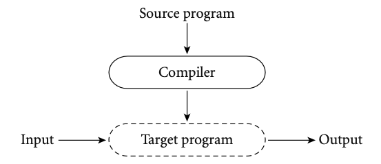

컴파일러는 고급 소스 프로그램을 동등한 대상 프로그램(일반적으로 기계어로)으로 변환한 다음 사라집니다. 나중에 사용자가 운영 체제에 대상 프로그램을 실행하도록 지시합니다. 컴파일러는 컴파일 중에 제어 위치에 있으며, 대상 프로그램은 자체 실행 중에 제어 위치에 있습니다. 컴파일러 자체는 기계어 프로그램이며, 아마도 다른 고급 프로그램을 컴파일하여 만든 것으로 보입니다. 운영 체제가 이해하는 형식으로 파일에 기록할 때 기계 언어는 일반적으로 객체 코드로 알려져 있습니다.

고급 언어의 대체 구현 스타일을 *interpretation*이라고 합니다.

**Example 1.8 Pure interpretation**


컴파일러와 달리 인터프리터는 응용 프로그램을 실행하기 위해 주변에 있습니다. 실제로 인터프리터는 실행 중 제어의 중심입니다. 실제로 인터프리터는 "머신 언어"가 고급 프로그래밍 언어인 가상 시스템을 구현합니다. 통역사는 그 언어로 된 문장을 어느 정도 한 번에 읽고 진행하면서 실행합니다.

일반적으로 interpretation은 컴파일보다 유연성이 더 높고 진단(오류 메시지)이 더 우수합니다. 소스 코드가 직접 실행되기 때문에 인터프리터는 우수한 소스 수준 디버거를 포함할 수 있습니다. 또한 변수의 크기와 종류, 심지어는 어떤 변수를 지칭하는 이름과 같은 프로그램의 기본 특성이 입력 데이터에 따라 달라질 수 있는 언어도 다룰 수 있습니다. 예를 들어, Lisp 및 Prolog에서 프로그램은 자신의 새로운 스크립트를 작성하고 즉시 실행할 수 있습니다. (여러 스크립트 언어도 이러한 기능을 제공합니다.) 실행 시간이 될 때까지 프로그램 구현에 대한 결정을 지연하는 것은 late binding으로 알려져 있습니다; 우리는 3.1절에서 더 길게 논의할 것입니다.

반면, 컴파일은 일반적으로 더 나은 성능을 제공합니다. 일반적으로 컴파일 시간에 내린 결정은 런타임에 내릴 필요가 없는 결정입니다. 예를 들어, 컴파일러가 변수 x가 항상 위치 49378에 있음을 보장할 수 있다면 원본 프로그램이 x를 참조할 때마다 이 위치에 액세스하는 기계어 명령을 생성할 수 있습니다. (final version of a) 프로그램은 한 번만 컴파일되지만 일반적으로 여러 번 실행되므로, 특히 인터프리터가 루프의 모든 반복에서 불필요한 작업을 수행하는 경우 상당한 절감 효과를 얻을 수 있습니다.

컴파일과 해석의 개념적 차이는 분명하지만, 대부분의 언어 구현은 두 가지 모두를 포함합니다. 일반적으로 다음과 같습니다.

**Example 1.9 Mixing complication and interpretation**

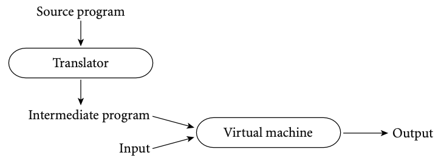

우리는 일반적으로 초기 번역기가 단순할 때 언어가"interpreted"되어 있다고 말합니다. 번역기가 복잡하면 우리는 언어가 "컴파일"되어 있다고 말합니다. "단순"과 "복합"은 주관적인 용어이고 컴파일러(복합 번역기)가 복잡한 가상 머신(인터프리터)에 의해 실행되는 코드를 생성하는 것이 가능하기 때문에 구별이 헷갈릴 수 있습니다. 이는 실제로 Java에서는 기본적으로 발생합니다. 우리는 번역자가 (일부 "기계적" 변환을 수행하는 대신) 철저하게 분석하고 중간 프로그램이 소스와 강하게 유사하지 않을 경우 언어를 컴파일한다고 여전히 말합니다. 이러한 두 가지 특성, 즉 철저한 분석과 사소한 변환은 컴파일의 특징입니다.

<aside>
💡 **DESIGN & IMPLEMENTATION**

특정 언어(예: Smalltalk 및 Python)는 대부분의 semantic error checking이 런타임에 수행되어야 하므로 "interpreted languages"라고도 합니다. 다른 특정 언어(예: 포트란 및 C)는 거의 모든 semantic error checking이 정적으로 수행될 수 있기 때문에 "compiled languages"라고도 합니다. 이 용어는 정확하지 않습니다: C 및 Portran용 인터프리터는 쉽게 빌드될 수 있으며 컴파일러는 코드를 생성하여 가장 광범위한 동적 semantic error checking도 수행할 수 있습니다. 그렇긴 하지만, 언어 디자인은 "compilability"에 깊은 영향을 미칩니다.

</aside>

실제로 다음과 같은 광범위한 구현 전략을 볼 수 있습니다.

**Example 1.10 Preprocessing** 

대부분의 *interpreted languages*는 주석과 공백을 제거하고 키워드, 식별자, 숫자 및 기호와 같은 토큰으로 문자를 그룹화하는 초기 번역기(전처리기)를 사용합니다. 번역기는 매크로 어셈블러 스타일로 약어를 확장할 수도 있습니다. 마지막으로, 루프 및 서브루틴과 같은 상위 수준의 구문 구조를 식별할 수 있습니다. 소스의 구조를 반영하지만 보다 효율적으로 해석할 수 있는 중간 형태를 만드는 것이 목표입니다.

Basic의 초기 구현에서는 실제로 프로그램의 성능을 향상시키기 위해 프로그램에서 주석을 제거할 것을 제안했습니다. 이러한 구현은 순전히 인터프리터였습니다. 프로그램의 특정 부분을 실행할 때마다 코멘트를 다시 읽고 무시했습니다. 그들은 초기 번역가가 없었습니다.

**Example 1.11 Library routines and linking**

전형적인 포트란 구현은 순수 컴파일에 가깝습니다. 컴파일러는 포트란 소스를 기계어로 번역합니다. 그러나 일반적으로 원본 프로그램의 일부가 아닌 서브루틴 라이브러리의 존재에 의존합니다. 예로는 수학 함수(sin, cos, log 등)와 I/O가 있습니다. 컴파일러는 링커라는 별도의 프로그램에 의존하여 적절한 라이브러리 루틴을 최종 프로그램에 병합합니다.

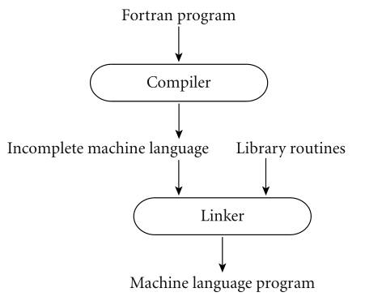

어떤 의미에서는 라이브러리 루틴을 하드웨어 명령어 집합의 확장으로 생각할 수 있습니다. 컴파일러는 하드웨어와 라이브러리의 기능을 모두 포함하는 가상 시스템의 코드를 생성하는 것으로 간주할 수 있습니다. 

문자 그대로, 포트란 루틴에서 포맷된 출력에 대한 해석을 찾을 수 있습니다. 포트란은 열의 출력 정렬, 부동소수점 숫자에 대한 유효 자릿수 및 과학적 표기법 유형, 선행 0의 포함/억제 등을 제어하는 형식 문을 사용할 수 있습니다. 프로그램은 자체 형식을 즉시 계산할 수 있습니다. 출력 라이브러리 루틴에는 형식 인터프리터가 포함됩니다. 비슷한 인터프리터는 C와 그 후손들의 프린트프 루틴에서 찾을 수 있습니다.

**Example 1.12 Post-compilation assembly**

많은 컴파일러가 기계어 대신 어셈블리어를 생성합니다. 어셈블리 언어는 사람들이 읽기 쉽기 때문에 디버깅을 용이하게 하고, 컴파일러를 새로운 운영 체제 릴리스에서 강제할 수 있는 기계어 파일 형식의 변경으로부터 격리시킵니다.

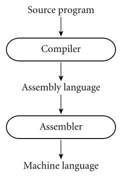

**Example 1.13 The C preprocessor**

C용 컴파일러(및 Unix에서 실행되는 다른 여러 언어의 경우)는 주석을 제거하고 매크로를 확장하는 전처리로 시작합니다. 또한 프리 프로세서는 코드 자체의 일부를 삭제하도록 지시할 수 있으며, 동일한 소스에서 프로그램의 여러 버전을 작성할 수 있는 조건부 컴파일 기능을 제공합니다.

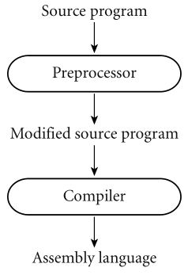

**Example 1.14 Source-to-source**

놀랍게도 많은 수의 컴파일러가 일부 고급 번역 언어(일반적으로 C 또는 일부 단순화된 입력 언어 버전)로 출력을 생성합니다. 이러한 소스 간 번역은 연구 언어와 언어 개발 초기 단계에서 특히 일반적입니다. 한 가지 유명한 예는 AT&T의 C++용 오리지널 컴파일러입니다. C++ 소스 프로그램의 구문과 의미론에 대한 완전한 분석을 수행했으며 프로그래머가 프로그램을 실행하기 전에 볼 수 있는 모든 오류 메시지를 생성했습니다. 사실, 프로그래머들은 일반적으로 C 컴파일러가 막후에서 사용되고 있다는 것을 알지 못했습니다. C++ 컴파일러는 오류 메시지를 생성하지 않고 2차 컴파일을 통과하는 C 코드를 생성하지 않는 한 C 컴파일러를 호출하지 않았습니다.

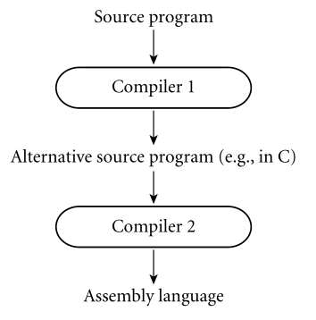

때때로 C++ 컴파일러가 컴파일된 높은 수준의 출력을 생성했기 때문에 전처리기라고 불리는 소리를 듣기도 했습니다. 컴파일러는 소스를 "이해"하려고 하지만 프리프로세서는 그렇지 않습니다. 프리프로세서는 간단한 패턴 일치를 기반으로 변환을 수행하며, 후속 변환 단계를 통해 실행될 때 오류 메시지를 생성하는 출력을 생성할 수 있습니다.

**Example 1.15 Bootstrapping**

컴퓨터 기술 에서 **부트스트래핑** 이라는 용어 는 동일한 언어로 코딩할 수 있는 언어 컴파일러를 나타냅니다. (예를 들어, C 컴파일러는 이제 C 언어로 작성되었습니다. 기본 컴파일러가 작성되면 반복적으로 개선할 수 있으므로 부트스트랩으로 언어를 끌어올릴 수 있습니다.)

많은 초기 파스칼 컴파일러들은 니클라우스 워스가 배포한 도구들을 기반으로 만들어졌습니다. 여기에는 다음이 포함됩니다.

- 파스칼로 작성된 파스칼 컴파일러로, 현대 자바 컴파일러의 바이트코드와 유사한 스택 기반 언어인 P-code로 출력을 생성합니다.
- P 코드로 변환된 컴파일러
- 파스칼로 작성된 P코드 인터프리터

Pascal을 로컬 컴퓨터에서 설정하고 실행하려면 도구 세트의 사용자는 P 코드 인터프리터를 로컬에서 사용할 수 있는 언어로 직접 번역하기만 하면 됩니다. 이 번역은 어려운 일이 아니었습니다. 인터프리터는 작았습니다. 컴파일러의 P-코드 버전을 P-코드 인터프리터 위에 실행하면 임의 파스칼 프로그램을 P-코드로 컴파일하여 인터프리터에서 실행할 수 있습니다. 더 빠른 구현을 위해 P코드(좀 더 어려운 작업)를 생성하는 대신 파스칼 컴파일러의 파스칼 버전을 수정하여 로컬로 사용 가능한 다양한 어셈블리 또는 기계어를 생성할 수 있습니다. 그런 다음 이 컴파일러를 부트스트랩(bootstrap, 자체 실행)하여 컴파일러의 기계 코드 버전을 생성할 수 있습니다.

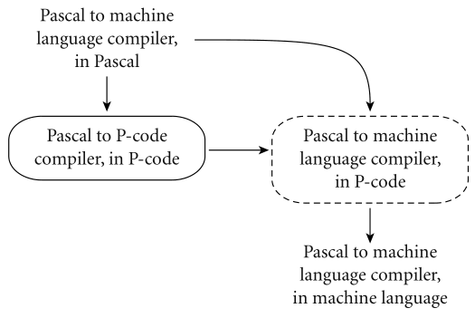

좀 더 일반적인 맥락에서 새로운 프로그래밍 언어를 위한 최초의 컴파일러 중 하나를 만들고 있다고 가정해 보겠습니다. 대상 시스템에 C 컴파일러가 있다고 가정하면 새 프로그래밍 언어의 동일한 하위 집합에 대한 컴파일러를 C의 단순한 하위 집합에 작성하는 것으로 시작할 수 있습니다. 컴파일러가 작동하면 C 코드를 새 언어로 직접 번역한 다음 컴파일러 자체를 통해 새 소스를 실행할 수 있습니다. 그 후 컴파일러를 반복적으로 확장하여 더 큰 서브셋을 수용할 수 있습니다.

<aside>
💡 DESIGN & IMPLEMENTATION

**파스칼의 초기 성공**
P코드 기반의 파스칼의 구현과 부트스트래핑의 사용은 파스칼이 학계에서 놀라운 성공을 거둔 큰 원인이 됩니다.
1970년대에 오늘날의 x86, Linux 및 Windows처럼 컴퓨터 환경을 지배한 하드웨어 플랫폼이나 운영 체제는 없었습니다.8 Wirth의 툴킷은 Pascal을 일주일 정도 만에 거의 모든 플랫폼에서 실행할 수 있게 만들었습니다. 이것은 시스템 이식성에 있어서 최초의 큰 성공들 중 하나였습니다.

</aside>

새로운 프로그래밍 언어를 다시 부트스트랩하고 확장 언어를 사용하여 더 큰 하위 집합을 구현합니다. 이러한 종류의 "셀프 호스팅" 구현은 실제로 매우 일반적입니다.

**Example 1.16 Compiling interpreted**

때때로 많은 late binding을 허용하는 언어(예: 리스프, 프롤로그, 스몰토크)용 컴파일러를 찾기도 하며 전통적으로 해석됩니다. 이러한 컴파일러는 일반적으로 인터프리터의 많은 작업을 수행하거나 대신 작동하는 라이브러리로 호출하는 코드를 생성하기 위해 준비되어야 합니다. 그러나 중요한 경우 컴파일러는 런타임까지 최종 결정되지 않을 결정에 대해 합리적인 가정을 하는 코드를 생성할 수 있습니다. 이러한 가정이 유효하면 코드는 매우 빠르게 실행됩니다. 가정이 올바르지 않으면 동적 검사가 불일치를 발견하고 인터프리터로 돌아갑니다.

**Example 1.17 Dynamic and just-in-time compilation**

경우에 따라 프로그래밍 시스템은 컴파일이 완료될 때까지 컴파일을 의도적으로 지연시킬 수 있습니다.
가능한 마지막 순간이에요 새로운 변환을 위해 컴파일러를 즉시 호출하는 언어 구현(예: Lisp 또는 Prolog)에서 한 가지 예가 발생합니다.
소스를 기계어로 만들거나 특정 입력 세트의 코드를 최적화합니다. 또 다른 예는 Java 구현에서 볼 수 있습니다. Java 언어 정의는 Java byte code로 알려진 기계 독립적인 중간 형식을 정의합니다. 바이트코드는 Java 프로그램 배포를 위한 표준 형식입니다. 인터넷을 통해 프로그램을 쉽게 전송한 다음 모든 플랫폼에서 실행할 수 있습니다. 최초의 자바 구현체는 바이트 코드 인터프리터에 기반을 두었지만, 현대의 구현체들은 프로그램의 각 실행 직전에 바이트코드를 기계 언어로 변환하는 just-in-time 컴파일러를 통해 훨씬 더 나은 성능을 얻습니다.

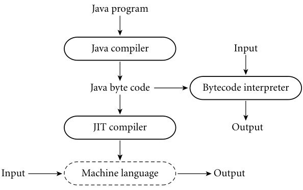

마찬가지로 C#도 즉시 번역을 위한 것입니다. 주 C# 컴파일러는 CIL(Common Intermediate Language)을 생성하고, CIL은 실행 직전에 기계어로 변환됩니다. CIL은 의도적으로 언어와 독립적이므로 다양한 프런트 엔드 컴파일러가 생성하는 코드에 사용할 수 있습니다. Java 및 C# 구현에 대해 섹션 16.1에서 자세히 살펴보겠습니다.

**Example 1.18 Microcode (firmware)**

일부 기계(특히 1980년대 중반 이전에 설계된 기계)에서 어셈블리 수준의 명령어 집합은 실제로 하드웨어에서 구현되지 않고 인터프리터에서 실행됩니다. 인터프리터는 읽기 전용 메모리에 저장되고 하드웨어에 의해 실행되는 마이크로코드(또는 펌웨어)라는 낮은 수준의 명령어로 작성됩니다. 마이크로코드 및 마이크로프로그래밍은 섹션 C 5.4.1에서 더 자세히 검토됩니다.

---

이러한 예들 중 일부가 분명히 나타내듯이 컴파일러가 반드시 고급 프로그래밍 언어를 기계어로 변환하는 것은 아닙니다. 실제로 일부 컴파일러는 즉시 프로그램으로 생각되지 않을 수 있는 입력을 수용합니다. 예를 들어, TEX와 같은 텍스트 형식 지정기는 높은 수준의 문서 설명을 레이저 프린터 또는 포토타이프세터용 명령어로 컴파일합니다. 데이터베이스 시스템의 쿼리 언어 프로세서는 SQL과 같은 언어를 파일의 기본 작업으로 변환합니다. 논리 수준의 회로 사양을 컴퓨터 칩용 사진 마스크로 변환하는 컴파일러도 있습니다. 비록 이 책의 초점은 명령형 프로그래밍 언어에 있지만, "컴파일"이라는 용어는 입력의 의미에 대한 완전한 분석과 함께 하나의 중요하지 않은 언어에서 다른 언어로 자동 번역될 때마다 적용됩니다.

## 1.5 Programming Environments

컴파일러와 인터프리터는 따로 존재하지 않습니다. 프로그래머들은 많은 다른 도구들의 도움을 받습니다. 어셈블러, 디버거, 프리프로세서, 링커 등이 앞서 언급되었습니다. 에디터는 모든 프로그래머에게 친숙합니다. 프로그래머가 객체가 사용되는 지점이 주어지면 객체가 정의되는 지점을 찾을 수 있는 상호 참조 기능을 통해 증강될 수 있습니다. 예쁜 프린터는 서식 규칙을 적용하는 데 도움이 됩니다. 스타일 체커는 컴파일러가 시행하는 것보다 더 엄격한 구문 또는 의미 규칙을 적용합니다(탐색 1.14 참조). 구성 관리 도구는 대규모 소프트웨어 시스템에서 별도로 컴파일된 모듈 간의 의존성을 추적하는 데 도움이 됩니다. 텍스트뿐 아니라 바이너리로 저장될 수 있는 중간 언어에 대해서도 열람 도구가 있습니다. 프로파일러 및 기타 성능 분석 도구는 종종 디버거와 함께 작동하여 계산 시간의 대부분을 소비하는 프로그램의 조각을 식별하는 데 도움이 됩니다. 오래된 프로그래밍 환경에서는 다음 위치에서 도구를 개별적으로 실행할 수 있습니다.
사용자의 명시적 요청입니다. 예를 들어 실행 중인 프로그램이 "bus error"(잘못된 주소) 메시지와 함께 비정상적으로 종료되는 경우, 사용자는 운영 체제에서 덤프된 "core" 파일을 검사하기 위해 디버거를 호출하도록 선택할 수 있습니다. 그런 다음 중단점을 설정하고 추적 등을 활성화한 다음 디버거의 제어 하에 프로그램을 다시 실행하여 프로그램 버그를 식별할 수 있습니다. 버그가 발견되면 사용자는 편집기를 호출하여 적절한 변경을 수행합니다. 그런 다음 구성 관리자의 도움을 받아 수정된 프로그램을 다시 컴파일합니다.

현대 환경은 보다 통합된 도구를 제공합니다. IDE(Integrated Development Environment)에서 잘못된 주소 오류가 발생하면 오류가 발생한 소스 코드의 줄이 강조 표시된 새 창이 사용자 화면에 나타날 수 있습니다. 그런 다음 디버거를 명시적으로 호출하지 않고 이 창에서 중단점과 추적을 설정할 수 있습니다. 편집기를 명시적으로 호출하지 않고 소스를 변경할 수 있습니다. 사용자가 변경한 후 프로그램을 다시 실행하도록 요청할 경우 컴파일러나 구성 관리자를 명시적으로 호출하지 않고 새 버전을 빌드할 수 있습니다. IDE용 편집기는 언어 구문에 대한 지식을 통합하여 모든 표준 제어 구조에 대한 템플릿을 제공하고 입력된 구문을 검사할 수 있습니다. 내부적으로 IDE는 프로그램의 소스 코드와 객체 코드뿐만 아니라 부분적으로 컴파일된 내부 표현도 유지할 수 있습니다. 소스를 편집하면 내부 표현이 자동으로 업데이트됩니다(종종 소스의 많은 부분을 재배치하지 않고). 프로그램에 대한 구조적 변경사항이 내부 표현에서 먼저 구현된 후 소스에 자동으로 반영되는 경우도 있습니다. IDE는 스몰토크의 기본이며, 그래픽 환경에서 언어를 구분하는 것은 거의 불가능하며 1980년대부터 Common Lisp에 일상적으로 사용되어 왔습니다. 그래픽 인터페이스가 보편화되면서 통합 환경은 많은 언어와 시스템의 명령줄 도구를 대체했습니다. 널리 사용되는 오픈 소스 IDE에는 Eclipse와 NetBeans가 있습니다. 상용 시스템에는 Microsoft의 Visual Studio 환경과 Apple의 XCode 환경이 포함됩니다. 통합의 외형의 많은 부분은 이맥과 같은 정교한 편집기에서도 달성될 수 있습니다.

<aside>
💡 CHECK YOUR UNDERSTANDING

1. compilation과 interpretation의 차이를 설명하세요. 두 가지 접근법의 비교적인 장점과 단점은 무엇입니까?
2. Java는 컴파일 또는 인터프리터(또는 둘 다)입니까?
3. 컴파일러와 전처리의 차이점은 무엇입니까?
4. 오리지널 AT&T C++ 회사에서 사용한 중간 형태는 무엇입니까?
5. P-코드가 무엇입니까?
6. 부트스트래핑이 뭐죠?
7. JIT 컴파일러란 무엇입니까?
8. 프로그램이 "즉시" 자신의 새로운 조각을 쓸 수 있는 두 언어를 말하시오.
9. 범용 프로세서에서 실행할 고급 프로그램을 준비하는 것이 목적이 아닌 세 가지 "전통적이지 않은" 컴파일러를 간략하게 설명합니다.
10. 대규모 프로그래밍 환경에서 컴파일러의 작업을 일반적으로 지원하는 6가지 도구를 나열합니다.
11. IDE(통합 개발 환경)가 명령줄 도구 모음과 어떻게 다른지 설명합니다.
</aside>

## 1.6 An Overview of Compilation

컴파일러는 가장 잘 연구된 컴퓨터 프로그램 중 하나입니다. 우리는 책의 나머지 부분, 특히 2, 4, 15, 17장에서 그것들을 반복적으로 고려할 것입니다. 이 섹션의 나머지 부분에서는 소개 개요를 제공합니다.

**Example 1.19 Phases of compilation and interpretation**

일반적인 컴파일러에서 컴파일은 그림 1.3에서와 같이 잘 정의된 일련의 단계를 통해 진행됩니다. 각 단계는 이후 단계에 대한 사용 정보를 검색하거나 프로그램을 후속 단계에 더 유용한 형태로 변환합니다. 처음 몇 단계는 (시맨틱 분석을 통해) 소스 프로그램의 의미를 파악하는 역할을 합니다. 컴파일러의 프런트 엔드로 불리기도 합니다. 마지막 몇 단계는 동등한 대상 프로그램을 구성하는 역할을 합니다. 컴파일러의 백엔드라고도 합니다.

인터프리터(그림 1.4)는 컴파일러의 프런트 엔드 구조를 공유하지만 중간 형식을 기계어로 번역하지 않고 직접 "실행"합니다. 일반적으로 실행은 구문 트리를 순회(워크)하는 상호 재귀 서브루틴 집합의 형태를 취하며 노드를 프로그램 순서로 "실행"합니다. 많은 컴파일러 및 인터프리터 단계가 원본 및/또는 대상 언어에 대한 공식적인 설명에서 자동으로 생성될 수 있습니다.

때때로 일련의 패스로 묘사되는 컴파일을 들을 수 있습니다. 패스는 나머지 컴파일과 관련하여 직렬화되는 페이즈 또는 페이즈 세트입니다. 패스는 이전 페이즈가 완료될 때까지 시작되지 않으며 이후 페이즈가 시작되기 전에 완료됩니다. 원하는 경우 패스를 별도의 프로그램으로 작성하여 파일에서 입력을 읽고 출력을 파일에 기록할 수 있습니다. 컴파일러는 일반적으로 패스로 나뉘어 프런트 엔드가 공유될 수 있습니다.

**Figure 1.3 Phases of compilation.**

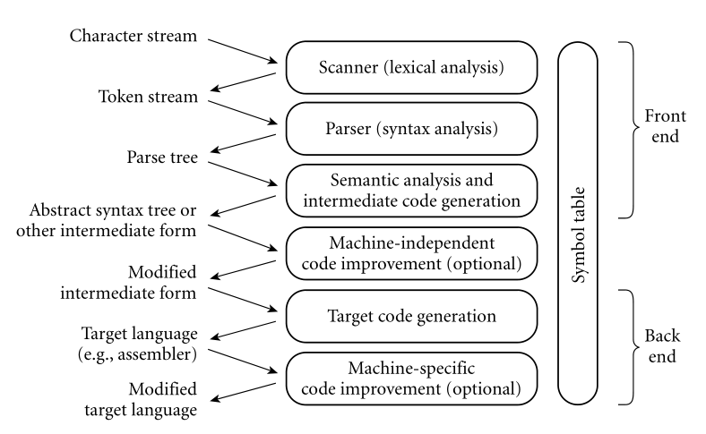

단계는 오른쪽에 나열되고 양식은 다음과 같습니다.
정보는 단계 간에 전달됩니다(왼쪽). 기호 테이블은 컴파일 내내 식별자에 대한 정보를 위한 저장소로 사용됩니다.

**Figure 1.4 Phases of interpretation.**

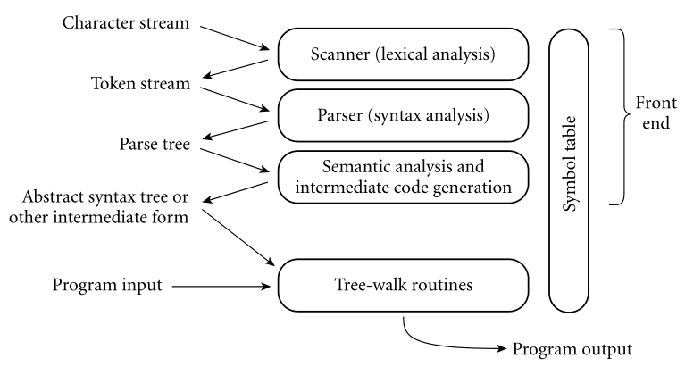

프런트 엔드는 컴파일러의 프런트 엔드와 본질적으로 동일합니다. 마지막 단계에서는 일반적으로 구문 트리를 실행하는 상호 재귀 서브루틴 집합을 사용하여 중간 양식을 "실행"합니다.

둘 이상의 머신(대상 언어)에 대해 백엔드를 둘 이상의 소스 언어에 대해 컴파일러가 공유할 수 있습니다. 일부 구현에서는 프런트 엔드와 백 엔드가 언어 및 기계 독립 코드 개선을 담당하는 "미들 엔드"에 의해 분리될 수 있습니다. 1980년대 중후반 메모리 크기가 급격하게 증가하기 전에 컴파일러는 다음과 같습니다.
또한 메모리 사용을 최소화하기 위해 패스로 나뉘기도 했습니다. 각 패스가 완료되면 다음 패스는 코드 공간을 재사용할 수 있습니다.

### 1.6.1 Lexical and Syntax Analysis

**Example 1.20 GCD program in C**

다음 C 코드를 고려해봅시다.

```c
int main() {
	int i = getint(), j = getint();
	while (i != j) {
		if (i > j) i = i - j;
		else j = j - i;
	}
	putint(i);
}
```

**Example 1.21 GCD program tokens**

스캔 및 파싱은 프로그램의 의미에 관계없이 프로그램의 구조를 인식하는 역할을 합니다. 스캐너는 문자('i', 'n', 't', 'm', 'a', 'i', 'n')를 읽습니다.
'(', ') 등) 및 토큰으로 그룹화합니다. 토큰은 프로그램의 최소 의미 단위입니다. 이 예에서 토큰은 다음과 같습니다.

```
int     main   (      )    {      int   i    =    getint (    )   ,    j    =   
getint  (      )      ;    while  (     i    !=   j      )    {   if   (    i  
j       )      i      =    i      -     j    ;    else   j    =   j    -    i
;     	}    	 putint (    i      )     ;    }
```

스캔은 어휘 분석(lexical analysis)이라고도 합니다. 스캐너의 주된 목적은 입력 크기를 줄이고(토큰보다 더 많은 문자 수) 공백과 같은 외부 문자를 제거하여 파서의 작업을 단순화하는 것입니다. 또한 스캐너는 일반적으로 주석을 제거하고 토큰에 줄과 열 번호를 태그하여 이후 단계에서 양호한 진단을 쉽게 생성할 수 있도록 합니다. 토큰 대신 문자를 입력으로 가져가도록 파서를 설계할 수 있습니다. 스캐너를 사용하는 대신, 결과는 어색하고 느릴 것입니다.

**Example 1.22 Context-free grammar and parsing**

구문 분석은 토큰을 구성 요소 측면에서 상위 수준의 구문 분석 구조(문, 표현식, 서브루틴 등)를 나타내는 구문 분석 트리로 구성합니다. 각 구조는 트리의 노드이며 구성 요소는 하위 항목입니다. 트리의 루트는 단순히 "프로그램"입니다; 왼쪽에서 오른쪽으로의 잎은 스캐너에서 받은 토큰입니다. 전체적으로, 트리는 토큰이 유효한 프로그램을 만들기 위해 어떻게 서로 결합되는지를 보여줍니다. 이 구조는 문맥 없는 문법이라고 알려진 잠재적으로 재귀적인 규칙 집합에 의존합니다. 각 규칙에는 왼쪽에 구성품 이름이 있고 오른쪽에 확장 가능한 화살표 기호(→)가 있습니다. 예를 들어 C에서 while loop는 키워드로 구성되며 부모 크기의 부울 표현식과 문은 다음과 같습니다.

iteration-statement → while ( expression ) statement

이 문은 종종 중괄호로 묶인 리스트입니다.

statement → compound-statement
compound-statement → { block-item-list opt }

where

block-item-list opt → block-item-list

or

block-item-list opt → ϵ

and

block-item-list → block-item
block-item-list → block-item-list block-item
block-item → declaration
block-item → statement

여기서 ϵ는 빈 문자열을 나타내며, block-item-list opt를 간단히 삭제할 수 있음을 나타냅니다. 물론 프로그램의 전체 구조를 설명하기 위해서는 더 많은 문법 규칙이 필요합니다.

**Example 1.23 GCD program parse tree**

context-free grammar는 언어의 구문을 정의한다고 하며, 구문 분석이라고 합니다. C에 대해 가능한 문법(사실 무한대로)이 많이 있습니다. 위의 부분은 공식 언어 정의에 포함된 샘플 문법 [Int99]에서 가져온 것입니다. GCD 프로그램의 전체 구문 분석 트리(여기에 표시되지 않은 전체 문법에 기초함)가 그림 1.5에 나와 있습니다. 나무의 크기가 위압적으로 보일 수 있지만, 이 시점에서 나무의 세부 사항은 특별히 중요하지 않습니다. 중요한 것은 입니다.

1. 각각의 분기점은 하나의 문법 규칙의 적용을 나타냅니다
2. 결과적인 복잡성은 입력 프로그램의 그것보다 문법을 더 반영합니다. 대량 생산의 대부분은 (a) 블록 항목 목록 및 블록 항목 목록과 같은 인위적인 "구성체"를 사용하여 임의 목록을 생성하는 선택에서 비롯됩니다.

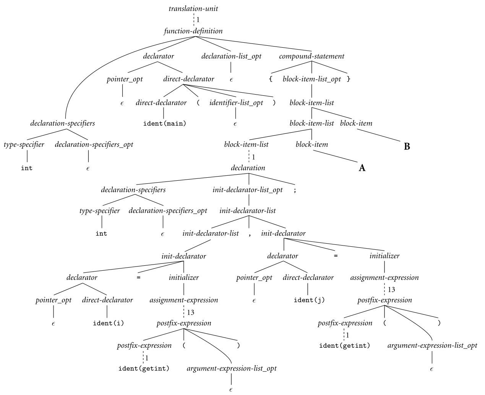

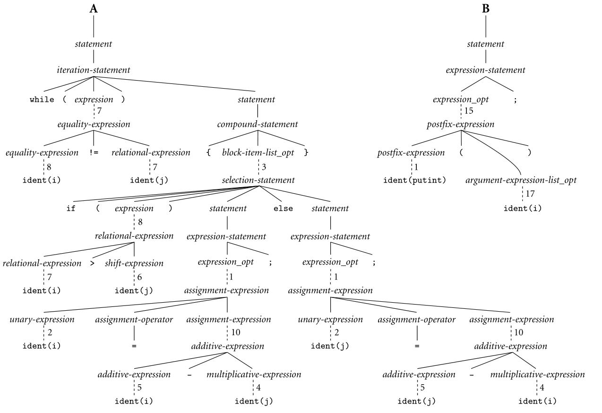

**Figure 1.5 Parse tree for the GCD program**

기호 ϵ는 빈 문자열을 나타냅니다. 점선은 공간을 절약하기 위해 생략된 일대일 교체 체인을 나타냅니다. 인접한 숫자는 생략된 노드의 수를 나타냅니다. 트리의 세부 사항은 현재 장에서 중요하지 않지만, 자세한 내용은 문맥 없는 문법의 계층 구조에 (훨씬 더 간단한) 소스 코드를 맞추어야 하는 것에서 비롯됩니다.

길이 및 (b) 동일한 인공 할당-표현, 가법 표현, 곱셈-표현 등을 사용하여 산술 표현식의 우선 순위와 연관성을 포착합니다. 우리는 파싱이 완료되면 이 복잡성의 많은 부분이 폐기될 수 있다는 것을 다음 하위 섹션에서 볼 것입니다.
스캔과 구문 분석 과정에서 컴파일러 또는 인터프리터는 프로그램의 모든 토큰이 잘 형성되었는지, 그리고 다음 순서인지 확인합니다.
토큰은 문맥 없는 문법에 의해 정의된 구문을 따릅니다. 잘못된 형식의 토큰(예: C의 123abc 또는 $@foo)은 스캐너에서 오류 메시지를 생성해야 합니다. 구문적으로 잘못된 토큰 시퀀스(예: A = X Y Z in C)는 구문 분석기에서 오류 메시지를 발생시킵니다.

### 1.6.2 Semantic Analysis and Intermediate Code Generation

의미 분석은 프로그램에서 의미를 발견하는 것입니다. 무엇보다도, 의미 분석기는 동일한 식별자가 여러 번 발생하더라도 동일한 프로그램 엔티티를 참조하도록 되어 있는 경우를 인식하고, 그 용도가 일관되도록 보장합니다. 또한 대부분의 언어에서 식별자와 표현식의 유형을 추적하여 일관된 사용을 확인하고 컴파일러의 백엔드에서 코드 생성을 안내합니다. 시맨틱 분석기는 작업을 지원하기 위해 일반적으로 각 식별자를 알려진 정보에 매핑하는 기호 테이블 데이터 구조를 구축하고 유지합니다. 무엇보다도 이 정보에는 식별자의 유형, 내부 구조(있는 경우) 및 범위(이 정보가 유효한 프로그램 부분)가 포함됩니다. 기호 테이블을 사용하여 의미 분석기는 컨텍스트 프리 문법과 구문 분석 트리의 계층 구조로 캡처되지 않는 다양한 규칙을 적용합니다. 예를 들어 C에서는 다음을 확인합니다.

- 모든 식별자는 사용 전에 선언됩니다.
- 식별자가 부적절한 컨텍스트(정수를 서브루틴으로 호출하고, 정수에 문자열을 추가하고, 잘못된 형식의 필드를 참조)에 사용되지 않습니다.
(구조 등)입니다.
- 서브루틴 호출은 올바른 인수 수와 유형을 제공합니다.
- 스위치 문 암의 레이블은 별개의 상수입니다.
- 반환 유형이 아닌 함수는 명시적으로 값을 반환합니다.

많은 프런트 엔드에서 의미 분석기의 작업은 구문 분석기가 문법 규칙 내에서 특정 지점에 도달했음을 인식할 때 파서에 의해 호출되는 의미 행동 루틴의 형태를 취합니다. 물론 모든 의미 규칙을 컴파일 시(또는 인터프리터의 프런트 엔드) 확인할 수 있는 것은 아닙니다. 가능한 것들을 언어의 정적 의미론이라고 합니다. 실행 시간(또는 인터프리터의 후반 단계에서)에 확인해야 하는 항목을 언어의 동적 의미론이라고 합니다. C는 동적 점검 방법이 거의 없습니다(설계자는 안전보다 성능을 더 선호함). 런타임에 다른 언어가 적용하는 규칙의 예는 다음과 같습니다.

- 변수는 값이 지정되지 않은 경우 식에 사용되지 않습니다.10
- 포인터는 유효한 개체를 참조하지 않는 한 참조 해제되지 않습니다.
- 배열 첨자 식이 배열의 경계 내에 있습니다.
- 산술 연산은 오버플로되지 않습니다.

정적으로 규칙을 적용할 수 없는 경우 컴파일러는 종종 런타임에 적절한 검사를 수행하기 위한 코드를 생성하며, 프로그램을 중단하거나 검사 중 하나가 실패할 경우 예외를 생성합니다.용출은 단순히 검사하지 못할 수 있습니다. 에이다에서는 이러한 규칙을 어기는 프로그램이 오류라고 하며, C에서는 그 동작이 정의되지 않았다고 합니다.

**EXAMPLE 1.24 GCD program abstract**

구문 분석 트리는 문맥 없는 문법의 규칙 하에서 토큰의 특정 시퀀스가 어떻게 파생될 수 있는지를 완전하고 구체적으로 보여주기 때문에 때때로 구체적인 구문 트리라고 알려져 있습니다. 그러나 토큰 시퀀스가 유효하다는 것을 알게 되면 구문 분석 트리의 많은 정보는 추가 컴파일 단계와 관련이 없습니다. 정적 의미 구문 트리 규칙을 확인하는 과정에서 의미 분석기는 일반적으로 트리 내부에 있는 대부분의 "인공" 노드를 제거하여 구문 분석 트리를 추상 구문 트리(AST 또는 단순히 구문 트리)로 변환합니다. 의미 분석기는 식별자에서 기호 테이블 항목에 대한 포인터와 같은 유용한 정보를 사용하여 나머지 노드에 주석을 달기도 합니다. 특정 노드에 부착된 주석을 해당 속성이라고 합니다. GCD 프로그램의 구문 트리는 그림 1.6에 나와 있습니다.

**EXAMPLE 1.25 Interpreting the syntax tree**

많은 인터프리터는 실행 중인 프로그램을 나타내기 위해 주석이 달린 구문 트리를 사용합니다. 그러면 "thead"는 트리 통과에 해당합니다. 우리의 GCD 프로그램에서 통역사는 그림 1.6의 근원에서 시작하여 나무의 주요 척추에 있는 문장을 순서대로 방문합니다. 첫 번째 ":=" 노드에서 인터프리터는 올바른 자식이 호출임을 알아차립니다. 따라서 getint 루틴(기호 테이블의 슬롯 3에 있음)을 호출하고 결과를 i(기호 테이블의 슬롯 5에 있음)에 할당합니다. 두 번째 ":=" 노드에서 인터프리터는 마찬가지로 getint의 결과를 j에 할당합니다. 노드가 진행되는 동안 왼쪽 하위 항목("thead=")을 반복적으로 평가하고 결과가 참이면 오른쪽 하위 항목 아래에 있는 트리를 재귀적으로 걷습니다. 마지막으로, 노드의 왼쪽 하위가 false로 평가되면, 인터프리터는 최종 호출 노드로 이동하여 결과를 출력합니다.

많은 컴파일러에서 주석이 달린 구문 트리는 프런트 엔드에서 백엔드로 전달되는 중간 형식을 구성합니다. 다른 컴파일러에서 의미 분석은 다른 중간 형식을 생성하는 트리(일반적으로 단일 패스)의 통과로 끝납니다. 그러한 하나의 일반적인 형태는 단순한 조립 언어의 단편과 노드가 닮은 제어 흐름 그래프로 구성됩니다.

**Figure 1.6 Syntax tree and symbol table for the GCD program.**

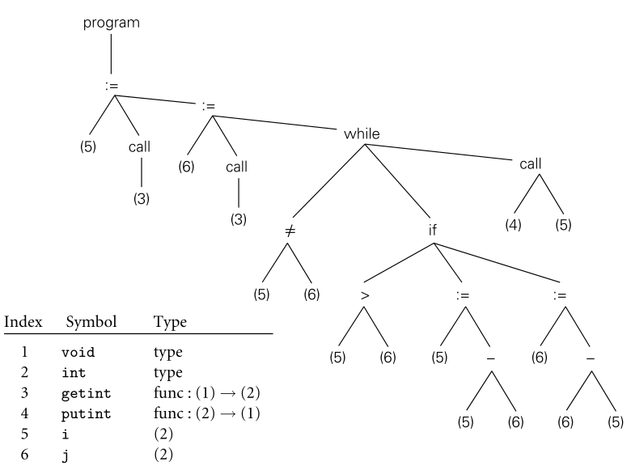

그림 1.5와의 대비: 구문 트리는 구문 분석 알고리즘을 구동하는 데만 필요한 세부 사항을 생략하고 프로그램의 필수 구조만 유지합니다.

이상화된 기계입니다. 우리는 GCD 프로그램에 대한 제어 흐름 그래프가 그림 15.3에 나타나 있는 15장에서 이 옵션을 더 고려할 것입니다. 관련 컴파일러 제품군에서 여러 언어의 프런트 엔드와 여러 시스템의 백 엔드는 공통 중간 형식을 공유합니다.

### 1.6.3 Target Code Generation

**EXAMPLE 1.26 GCD program assembly code**

컴파일러의 코드 생성 단계는 중간 양식을 대상 언어로 변환합니다. 구문 트리에 포함된 정보를 고려할 때 올바른 코드를 생성하는 것은 보통 어려운 작업이 아닙니다(1.6.4절에서 볼 수 있듯이 좋은 코드를 생성하는 것은 더 어렵습니다). 어셈블리 또는 기계어를 생성하기 위해 코드 생성기는 기호 테이블을 통과하여 변수에 위치를 할당한 다음 프로그램의 중간 표현을 통과하여 변수 참조에 대한 로드 및 저장소를 생성하고 적절한 산술 연산, 테스트 및 분기를 흩뿌립니다. 우리의 GCD 예에 대한 단순한 코드는 x86 어셈블리 언어로 그림 1.7에 나타나 있습니다. 그것은 간단한 교육학 컴파일러에 의해 자동으로 생성되었습니다.

**Figure 1.7 Naive x86 assembly language for the GCD program.**

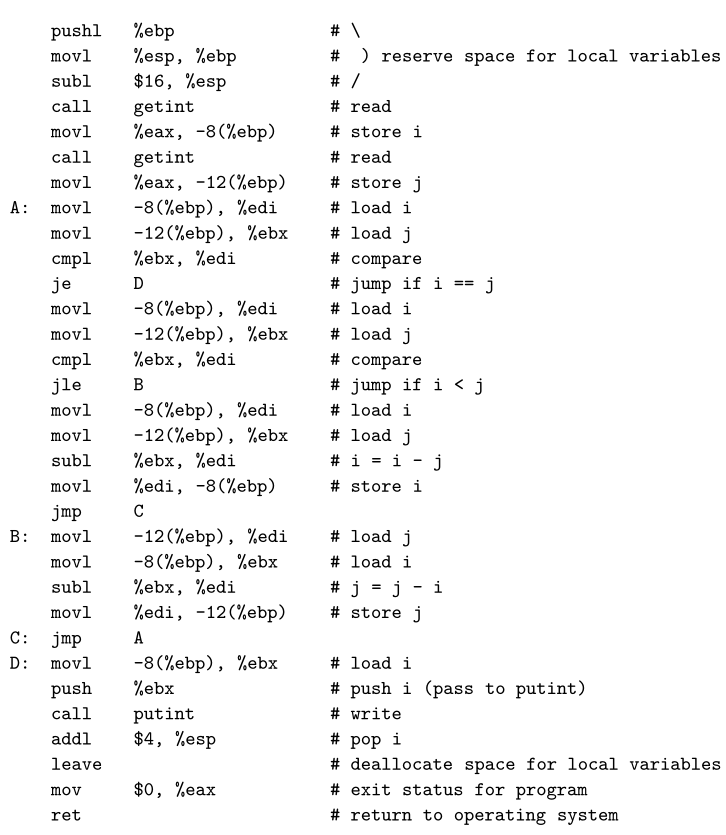

어셈블리 언어 니모닉은 다소 모호하게 보일 수 있지만 각 줄의 주석(컴파일러에 의해 생성되지 않음!)은 그림 1.6과 1.7 사이의 대응 관계를 일반적으로 분명하게 만들 것입니다. 몇 가지 힌트: ebp, eax, ebx 및 edi는 레지스터입니다(특수 보관 위치, 수가 제한되어 있어 매우 빠르게 액세스할 수 있음). -8(%ebp)은 주소가 ebp 레지스터에 있는 위치 앞의 8바이트 메모리 위치를 의미합니다. 이 프로그램에서 ebp는 변수 i와 j를 찾을 수 있는 베이스 역할을 합니다. 서브루틴 호출 명령어에 대한 인수는 스택에 인자를 푸시하여 전달되며, 이 인수에 대한 인수는 스택의 최상위 포인터입니다. 반환 값은 레지스터 eax로 반환됩니다. 산술 연산은 두 번째 인수를 연산의 결과로 덮어씁니다.

코드 생성기는 종종 심볼 디버거에서 나중에 사용할 수 있도록 대상 코드의 존재하지 않는 부분에 포함시켜 기호 테이블을 저장합니다.

### 1.6.4 Code Improvement

**Example 1.27 GCD program**

코드 개선은 종종 최적화라고 부르지만, 절대적인 의미에서 최적의 결과를 만들어 내는 경우는 거의 없습니다. 이 컴파일 단계는 프로그램을 동일한 결과를 보다 효율적으로 계산하는 새로운 버전으로 변환하는 것을 목표로 하는 선택적 컴파일 단계입니다. 일부 개선 사항은 기계와 무관합니다. 이것은 중간 양식에서 변환으로 수행될 수 있습니다. 다른 개선 사항으로는 대상 머신(또는 대상 언어로 프로그램을 실행하는 모든 것)에 대한 이해가 필요합니다. 이러한 작업은 대상 프로그램에서 변환으로 수행되어야 합니다. 따라서 코드 개선은 종종 컴파일러 단계 목록에 두 번 나타납니다. 의미 분석 및 중간 코드 생성 직후와 대상 코드 생성 직후입니다. 그림 1.7의 코드에 우수한 코드 임프로스터를 적용하면 코드가 생성됩니다.

예제 1.27 GCD 프로그램입니다.
최적화는 예 1.2에 나와 있습니다. 두 프로그램을 비교해보면 개선된 버전이 훨씬 짧다는 것을 알 수 있습니다. 눈에 띄게 대부분의 짐과 가게가 없습니다. 기계 독립 코드 임프로버는 메인 루프를 실행하는 동안 i와 j를 레지스터에 보관할 수 있는지 확인할 수 있습니다. (예를 들어, 이 루프가 레지스터를 재사용하거나 i 또는 j를 수정하려고 할 수 있는 서브루틴에 대한 호출을 포함하고 있는 경우에는 그렇지 않습니다.) 그러면 기계별 코드 임팩터가 대상 시스템의 실제 레지스터에 i와 j를 할당할 수 있습니다. 내부 동작이 복잡한 최신 마이크로프로세서의 경우 컴파일러는 일반적으로 인간 어셈블리 언어 프로그래머보다 더 나은 코드를 생성할 수 있습니다.

<aside>
💡 **CHECK YOUR UNDERSTANDING**

- 편찬의 주요 단계를 나열하고, 다음에 의해 수행된 작업을 설명합니다.
각각
- 해석의 일부로도 실행되는 단계를 나열합니다.
- 스캐너에서 다음으로 프로그램이 전달되는 형태를 설명하십시오.
구문 분석기, 구문 분석기에서 의미 분석기로, 의미 분석기에서 사용됩니다.
중간 코드 생성기에 연결합니다.
- 컴파일러의 프런트 엔드와 백 엔드를 구분하는 것은 무엇입니까?
- 단계와 패스의 차이는 무엇입니까? 무엇을요?
컴파일러가 여러 개의 패스를 갖는 것이 말이 됩니까?
- 컴파일러의 기호 표의 목적은 무엇입니까?
- 정적 의미론과 동적 의미론의 차이는 무엇입니까?
- 현대 기계에서, 조립 언어 프로그래머들은 여전히 글을 쓰는 경향이 있습니까?
좋은 컴파일러가 할 수 있는 것보다 더 나은 코드인가요? 왜 그런가요? 혹은 왜 그렇지 않은가요?
</aside>

## 1.7 Summary and Concluding Remarks

이 장에서는 프로그래밍 언어 설계 및 구현에 대한 연구를 소개했습니다. 우리는 언어가 왜 이렇게 많은지, 무엇이 언어를 성공하게 하는지, 어떻게 연구를 위해 분류될 수 있는지, 독자가 그 연구를 통해 얻을 수 있는 이득은 무엇인지 등을 고려했습니다. 우리는 언어 디자인과 언어 구현이 서로 긴밀하게 연결되어 있다는 점에 주목했습니다. 분명히 구현은 언어의 규칙에 따라야 합니다. 동시에 언어 디자이너는 다양한 기능을 구현하는 것이 얼마나 쉬울지, 어려울지, 그리고 어떤 종류의 성능이 나타날지 고려해야 합니다. 언어 구현은 일반적으로 해석에 기반한 것과 컴파일에 기반한 것으로 구분됩니다. 그러나 이러한 접근법 간의 차이는 모호하며, 대부분의 구현에는 각각 조금씩 포함되어 있다는 점에 주목했습니다. 일반적으로, 우리는 실행이 다음과 같은 번역 단계에 의해 선행되는 경우 언어를 컴파일한다고 말합니다.

1. 프로그램의 구조(구조)와 의미(의미)를 모두 완벽하게 분석합니다.
2. 상당히 다른 형태로 동등한 프로그램을 제작합니다. 이 책에 있는 구현 자료의 대부분은 컴파일과 관련되어 있습니다.

컴파일러는 일반적으로 일련의 단계로 구성됩니다. 검색, 구문 분석 및 시맨틱 분석과 같은 처음 몇 단계는 소스 프로그램을 분석합니다. 집합적으로 이러한 단계를 컴파일러의 프런트 엔드라고 합니다. 목표 코드 생성 및 기계별 코드 개선과 같은 마지막 몇 단계를 백엔드라고 합니다. 소스의 의미와 일치하는 대상 프로그램(가급적 빠른 프로그램)을 구축하는 역할을 합니다. 프런트 엔드와 백 엔드 사이에서 우수한 컴파일러는 광범위한 기계 독립 코드 개선을 수행합니다. 이 "미들 엔드"의 단계는 일반적으로 컴파일러 코드의 대부분을 구성하며 실행 시간의 대부분을 차지합니다.

3장, 6장, 7장, 8장, 9장, 10장이 이 책의 나머지 부분을 구성합니다. 그것들은 프로그래머와 언어 구현자의 관점 모두에서 언어 설계의 근본적인 문제들을 다룹니다. 구현에 대한 논의를 지원하기 위해 2장과 4장에서는 컴파일러 프런트 엔드에 대해 이 서론에서 설명했던 것보다 더 자세히 설명합니다. 챕터 5에서는 어셈블리 레벨 아키텍처에 대한 개요를 제공합니다. 15장부터 17장까지는 어셈블러 및 링커, 런타임 시스템, 코드 개선 기술을 포함한 컴파일러 백엔드에 대해 설명합니다. 추가적인 언어 패러다임은 11장부터 14장까지 다룹니다. 부록 A에는 본문에서 언급된 주요 프로그래밍 언어가 계보 및 참고 문헌과 함께 나열되어 있습니다. 부록 B에는 "설계 및 구현" 사이드 바 목록이 있으며, 부록 C에는 번호가 매겨진 예제 목록이 있습니다.

## 1.8 Exercises

1.1  Errors in a computer program can be classified according to when they are detected and, if they are detected at compile time, what part of the compiler detects them. Using your favorite imperative language, give an example of each of the following.

1. A lexical error, detected by the scanner
2. A syntax error, detected by the parser
3. A static semantic error, detected by semantic analysis
4. A dynamic semantic error, detected by code generated by the compiler
5. An error that the compiler can neither catch nor easily generate code tocatch (this should be a violation of the language definition, not just a program bug)

1.2  Consider again the Pascal tool set distributed by Niklaus Wirth (Example 1.15). After successfully building a machine language version of the Pascal compiler, one could in principle discard the P-code interpreter and the P-code version of the compiler. Why might one choose *not* to do so?

1.3 Imperative languages like Fortran and C are typically compiled, while scripting languages, in which many issues cannot be settled until run time, are typically interpreted. Is interpretation simply what one “has to do” when compilation is infeasible, or are there actually some *advantages* to interpreting a language, even when a compiler is available?

1.4  The gcd program of Example 1.20 might also be written

```c
int main() {
	int i = getint(), j = getint();
	while (i != j) {
		if (i > j) i = i % j;
		else j = j % i;
	}
	putint(i);
}
```

Does this program compute the same result? If not, can you fix it? Under what circumstances would you expect one or the other to be faster?

1.5  Expanding on Example 1.25, trace an interpretation of the gcd program on the inputs 12 and 8. Which syntax tree nodes are visited, in which order?

1.6  Both interpretation and code generation can be performed by traversal of a syntax tree. Compare these two kinds of traversals. In what ways are they similar/different?

1.7  In your local implementation of C, what is the limit on the size of integers? What happens in the event of arithmetic overflow? What are the  implications of size limits on the portability of programs from one machine/compiler to another? How do the answers to these questions differ for Java? For Ada? For Pascal? For Scheme? (You may need to find a manual.)

1.8 The Unix make utility allows the programmer to specify *dependences* among the separately compiled pieces of a program. If file *A* depends on file *B* and file *B* is modified, make deduces that *A* must be recompiled, in case any of the changes to *B* would affect the code produced for *A*. How accurate is this sort of dependence management? Under what circumstances will it lead to unnecessary work? Under what circumstances will it fail to recompile something that needs to be recompiled?

1.9 Why is it difficult to tell whether a program is correct? How do you go about finding bugs in your code? What kinds of bugs are revealed by testing? What kinds of bugs are not? (For more formal notions of program correctness, see the bibliographic notes at the end of Chapter 4.)

### 답

1-1 C언어

1. int 1a = 1;
2. int main( {}
3. int i; i++;
4. for(; i++; ); {} //데드루프
5. return 1/0 //정의되지 않은 동작

1.2 언어를 더 확장하기 위해

1.3 컴파일러 대신 인터프리터를 사용하는 이유는 유연성이 더 높고 진단이 더 우수하다. 소스 코드가 직접 실행되기 때문에 인터프리터는 우수한 소스 수준 디버거를 포함할 수 있다. 혹은 그저 언어 디자인 때문일 수도 있다.

1.4 같은 결과가 나온다. 모듈러 연산을 사용하기 떄문에 기존보다 연산량이 월등히 줄어든다.

1.5 

program → := → 5 → call → 3 → 

:= → 6 → call → 3 →

while → ≠ → 5 → 6 →

if → > → 5 → 6 →

:= → 5 → - → 5 → 6 →

while → ≠ → 5 → 6 →

if → > → 5 → 6 →

:= → 6 → - → 6 → 5 →

while → ≠ → 5 → 6 →

call → 4 →5

1.6 컴파일러와 인터프리터의 프론트 엔드 구조는 동일하나 인터프리터는 intermediate form을 기계어로 번역하지 않고 직접 실행한다.

1.7

1.8

1.9

## 1.9 Explorations

1.10

1. What was the first programming language you learned? If you chose it, why did you do so? If it was chosen for you by others, why do you think they chose it? What parts of the language did you find the most difficult to learn?
2. For the language with which you are most familiar (this may or may not be the first one you learned), list three things you wish had been differently designed. Why do you think they were designed the way they were? How would you fix them if you had the chance to do it over? Would there be any negative consequences, for example in terms of compiler complexity or program execution speed?

1.11 Get together with a classmate whose principal programming experience is with a language in a different category of Figure 1.1. (If your experience is mostly in C, for example, you might search out someone with experience in Lisp.) Compare notes. What are the easiest and most difficult aspects of programming, in each of your experiences? Pick a simple problem (e.g., sorting, or identification of connected components in a graph) and solve it using each of your favorite languages. Which solution is more elegant (do the two of you agree)? Which is faster? Why?

1.12 

1. If you have access to a Unix system, compile a simple program with the -S command-line flag. Add comments to the resulting assembly language file to explain the purpose of each instruction.
2. Now use the -o command-line flag to generate a *relocatable object file*. Using appropriate local tools (look in particular for nm, objdump, or a symbolic debugger like gdb or dbx), identify the machine language corresponding to each line of assembler.
3. Using nm, objdump, or a similar tool, identify the *undefined external symbols* in your object file. Now run the compiler to completion, to produce an *executable* file. Finally, run nm or objdump again to see what has happened to the symbols in part (b). Where did they come from—how did the linker resolve them?
4. Run the compiler to completion one more time, using the -v commandline flag. You should see messages describing the various subprograms invoked during the compilation process (some compilers use a different letter for this option; check the man page). The subprograms may include a preprocessor, separate passes of the compiler itself (of ten two), probably an assembler, and the linker. If possible, run these subprograms yourself, individually. Which of them produce the files described in the previous subquestions? Explain the purpose of the various command-line flags with which the subprograms were invoked.

1.13 Write a program that commits a dynamic semantic error (e.g., division by zero, access off the end of an array, dereference of a null pointer). What happens when you run this program? Does the compiler give you options to control what happens? Devise an experiment to evaluate the cost of runtime semantic checks. If possible, try this exercise with more than one language or compiler.

1.14 C has a reputation for being a relatively “unsafe” high-level language. For example: it allows the programmer to mix operands of different sizes and types in many more ways than its “safer” cousins. The Unix lint utility can be used to search for potentially unsafe constructs in C programs. In effect, many of the rules that are enforced by the compiler in other languages are optional in C, and are enforced (if desired) by a separate program. What do you think of this approach? Is it a good idea? Why or why not?

1.15 Using an Internet search engine or magazine indexing service, read up on the history of Java and C#, including the conflict between Sun and Microsoft over Java standardization. Some have claimed that C# was, at least in part, an attempt by Microsoft to undermine the spread of Java. Others point to philosophical and practical differences between the languages, and argue that C# more than stands on its merits. In hindsight, how would you characterize Microsoft’s decision to pursue an alternative to Java?

## 1.10 Bibliographic Notes

이 책의 컴파일러 지향 챕터들은 컴파일러를 만드는 방법을 설명하기 보다는 컴파일러가 무엇을 하는지에 대한 의미를 전달하려고 합니다. 훨씬 더 자세한 내용은 다른 문헌에서 찾아볼 수 있습니다. 선행 옵션은 Aho의 작업을 포함합니다.
[ALSU07], Cooper and Torczon [CT04], Fischer 등 [FCL10]의 세 가지 분류가 있습니다. 다른 우수하고, 덜 최신화된 텍스트로는 Appel [App97]과 Grune 등이 있습니다 [GBJ+12]. 프로그래밍 언어 설계에 대해 널리 사용되는 텍스트에는 Louden [LL12], Sebesta [Seb15] 및 Sethi [Set96]의 텍스트가 포함됩니다.
프로그래밍 언어의 역사에 대한 최고의 정보는 1978년, 1993년, 2007년에 컴퓨터 기계 협회가 후원한 컨퍼런스 진행에서 확인할 수 있습니다[Wex78, Ass93, Ass07]. 또 다른 훌륭한 참고 문헌은 1987년 호로비츠의 텍스트 [Hor87]입니다. 보다 광범위한 역사적 자료는 분기별 IEEE 컴퓨팅 역사 연보에서 확인할 수 있습니다. 프로그래밍 언어 디자인에서 개인의 취향의 중요성을 고려할 때, 일부 언어 비교는 강한 단어들의 의견으로 표시되어야 합니다. 초기의 예로는 Dijkstra [Dij82], Hoare [Hoa81], Kernighan [Ker81], Wirth [Wir85a]의 저서가 있습니다.
대부분의 현대 소프트웨어 개발은 통합 프로그래밍 환경에서 이루어집니다. 이러한 환경에 대한 영향력 있는 전구체로는 심볼릭스 코퍼레이션[WMWM87]과 Smalltalk [Gol84]의 Interlisp [TM81] 및 Xerox Palo Alto 연구 센터의 Cedar [SZBH86] 환경이 있습니다.


```toc

```