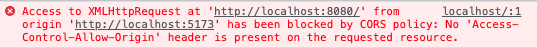

웹 개발을 하다보면 자주 CORS 에러를 만날 수 있습니다. 이번에야 말로 CORS가 무엇인지 확실히 알아보고 왜 있어야 하는지 알아봅시다.

## CORS가 나를 괴롭힌다



로컬에서 개발하고 있던 중 서버에 http 요청을 했을 때 위와 같은 에러를 보게 되었습니다.

'Access-Control-Allow-Origin' header is present on the requested resource.

요컨데 클라이언트의 주소는 localhost:5173인데 api요청 주소는 localhost:8080이기 때문에 origin이 다르다. Access-Control-Allow-Origin 헤더가 따로 설정되어 있지 않기 때문에 이 요청은 내가 막았다! 랍니다..

### 기존 해결법

저는 제대로 이해도 안한채 그냥 구글에 널린 해결책을 사용했습니다.

- create-react-app으로 만든 프로젝트에서 package.json에 proxy설정하여 클라이언트 주소를 api서버 주소로 바꿔치기 한다.
    - 만약 api 주소가 https://api.com이라면
    
    ```bash
    {
    	...
      "proxy": "https://api.com"
    	...
    }
    ```
    
    ```tsx
    //기존 통신 코드
    fetch("https://api.com/user")
    
    //수정 후 통신 코드
    fetch("/user")
    ```
    
- 그 후 배포할 때는 api 서버가 위치한 곳에 같이 배포하여 origin이 같도록 만든다.

사실 이정도만 해도 대부분의 해결되었기에.. 크게 신경 안쓰고 개발을 해 왔습니다만. 제가 제어할 수 없는 곳에서도 CORS 에러가 나더군요..

OAuth를 구현하기 위해 서버 개발자와 머리를 싸매고 있었습니다.

1. 클라이언트 → 서버: OAuth 요청
2. 서버 → 클라이언트: OAuth 로그인 페이지로 redirect
3. 클라이언트 → 인증기관: 로그인 완료
4. 인증기관 → 서버: 토큰 전달
5. 서버 → 클라이언트: 인증 완료 응답

2번에서 클라이언트는 기관에 요청했는데 그에 대한 응답은 5번에서 서버에서 오기 때문에 origin이 달라 에러가 발생했다는 것입니다.

그때부터 이 CORS정책에 대해 자세히 이해해야 겠다 마음먹고 공부를 하게 되었죠..

## Origin이란?

그래서 자꾸 등장하는 origin이라는 것은 대체 무엇인가?

origin은 출처라는 뜻으로 URL에서 Scheme, Host, Post까지를 의미합니다.

http 요청시 일부 요청에는 자동으로 origin 헤더가 추가되어 전달됩니다.


Scheme, Host, Post 3가지만 동일하면 동일한 origin이라 합니다.

window.location.origin에 해당 사이트의 origin이 담겨있습니다.

> IE 브라우저는 origin을 비교할 때 Port는 무시했습니다. 이젠 역사속으로 보내줍시다..
> 

## SOP(Same Origin Policy)

갑자기 CORS가 아니라 다른 정책이 등장했는데요, CORS가 등장한 배경을 이해하기 위해선 필수로 알아야 합니다.

SOP는 `같은 origin만 리소스를 공유할 수 있다.` 라는 정책으로 2011년 RFC 6454에서 처음 등장했습니다.

### 필요한 이유

origin이 다른 두 어플리케이션이 자유롭게 소통할 수 있는 환경은 사실 굉장히 위험합니다. 밑에서 설명할 CSRF, XSS 공격이 이러한 허점을 이용한 공격법입니다.

이러한 정책은 모두 브라우저에서 실제 구현되고 있으며 교차 출처 HTTP 요청을 직접 제한하게 됩니다.

그러나 웹에서 다른 출처에 있는 리소스를 사용하는 것은 굉장히 흔한 일이기 때문에 무작정 제한할 수만은 없었습니다.

따라서 등장한 것이 다른 출처에서도 리소스를 공유할 수 있도록 세운 정책이 CORS입니다.

우리가 CORS 에러를 보았다는 것은, SOP 정책을 위반하는 사항에 대해 CORS 정책까지 위반하여서 리소스가 제한된 것입니다.

## CORS(Cross Origin Resource Sharing)

이름 그대로 `다른 출처의 자원의 공유`에 대한 정책입니다.

다른 출처의 자원에 대해 SOP를 위반하지만 CORS 정책을 따르면 허용하겠다는 것입니다.

### 기본 동작

1. 웹에서 HTTP 요청을 서버로 보낼 때 브라우저는 요청에 origin 헤더를 추가하여 origin을 담아 보낸다.
2. 서버는 응답 헤더에 **Access-Control-Allow-Origin**에 이 리소스에 접근할 수 있는 Origin을 담아 보낸다.
3. 브라우저는 교차출처 응답에 대해 요청 헤더의 origin이 응답 헤더의 **Access-Control-Allow-Origin**에 적합한지 판단한다.
    1. 적합하지 않은 경우: 응답이 200 OK 이더라도 버리고 에러를 출력한다
    2. 적합한 경우: 문제없이 가져온다.

이것이 기본적으로 브라우저에서 CORS가 작동하는 원리입니다. 결국은 서버에서 헤더를 잘 처리해주는 것이 중요합니다.

## CORS 작동 시나리오

### Preflight Request

브라우저는 본 요청을 하기 전에 Preflight Request(예비 요청)를 보내 서버와 잘 통신할 수 있는지 확인하는 요청을 보냅니다.

이러한 이유는 cross-origin 요청 자체가 유저 데이터에 영향을 줄 수 있기 때문입니다.

예비 요청은 OPTIONS 메서드로 몇가지 헤더를 통해 확인 절차를 밟게 됩니다.


1. 자바스크립트 fetch()를 통해 POST 요청을 보낸다.
2. 브라우저는 서버로 HTTP OPTIONS 메서드를 통해 Preflight(예비) 요청을 보낸다.
    1. origin 헤더에 자신의 출처를 적는다.
    2. Access-Control-Request-Method 헤더에 실제 요청에 사용할 메소드를 적는다.
    3. Access-Control-Request-Headers 헤더에 실제 요청에 사용할 헤더들을 적는다.
3. 서버는 예비 요청에 대한 응답으로 헤더에 허용할 범위를 적어 보냅니다.
    1. Access-Control-Allow-Origin 헤더에 허용되는 Origin들의 목록을 설정한다.
    2. Access-Control-Allow-Methods 헤더에 허용되는 메소드들의 목록을 설정한다.
    3. Access-Control-Allow-Headers 헤더에 허용되는 헤더들의 목록을 설정한다.
    4. Access-Control-Max-Age 헤더에 해당 예비 요청이 브라우저에 캐시 될 수 있는 시간을 초 단위로 설정한다.
4. 브라우저는 보낸 요청과 서버의 응답을 비교하여 해당 요청이 안전한지 확인한 후 본 요청을 보낸다.
5. 서버의 본 요청이 대한 응답까지 확인을 하면 데이터를 자바스크립트로 넘긴다.

이때 CORS 위반이 발생할 수 있는 지점은 4번, 5번입니다.

4번 예비 요청의 응답이 CORS 정책에 위반될 경우 CORS 에러를 내고 본 요청을 보내지 않습니다.

5번 본 요청의 응답이 CORS 정책에 위반될 경우 CORS 에러를 내고 응답을 버립니다.


이러한 예비 요청의 결과는 브라우저에 캐싱되어 동일한 예비 요청을 보낼 경우 재활용하게 됩니다.

### Simple Request

다음 3가지 조건을 만족할 경우 simple request를 합니다.

1. 요청의 메소드는 GET, HEAD, POST 중 하나여야 한다.
2. Accept, Accept-Language, Content-Language, Content-Type, DPR, Downlink, Save-Data, Viewport-Width, Width 헤더일 경우 에만 적용된다.
3. Content-Type 헤더가 application/x-www-form-urlencoded, multipart/form-data, text/plain중 하나여야한다. 아닐 경우 예비 요청으로 동작된다.


Simple Request는 Preflight Request를 트리거하지 않습니다. 단순하게 origin만 비교하는 과정을 거칩니다.

따라서 위에서 설명한 5가지 단계에서 예비 요청을 보내는 과정을 제거하면 동일합니다.

하지만 대부분 HTTP 요청의 Content-Type은 text/html이나 application/json이기 때문에 Simple Request요청의 조건은 까다롭다 할 수 있습니다.

따라서 대부분의 요청은 Preflight 요청을 보낸다고 생각하면 되겠습니다.

### Credentialed Request

Credentialed Request(인증된 요청)는 클라이언트에서 서버에게 자격 증명(인증 정보)를 실어 요청할 때 사용됩니다.

이때 자격은 session id가 담겨 있는 쿠키나 Authorization 헤더에 설정하는 토큰값 등을 말합니다.

즉 클라이언트에서 인증 정보를 포함하여 다른 출처로 요청을 보낼 때는 Credentialed Request로 동작하게 됩니다.

### 클라이언트에서 허용

기본적으로 브라우저는 cross-site에서 별도의 옵션 없이는 인증 정보를 함부로 요청 데이터에 담아 보내지 않습니다.

따라서 Fetch나 XMLHttpRequest를 호출할 때 credentials 옵션을 설정해야 합니다.

| credentials 값 | 설명 |
| --- | --- |
| same-origin(default) | 같은 출처 간 요청에만 인증 정보를 담을 수 있다. |
| include | 모든 요청에 인증 정보를 담을 수 있다. |
| omit | 모든 요청에 인증 정보를 담지 않는다. |

```tsx
// fetch
fetch("https://api.example.com/data", {
	method: "POST",
	credentials: "include",
	...
})
```

```tsx
// axios
axios.post('https://api.example.com/data', data, { 
	withCredentials: true // include 옵션
})
```

```tsx
const invocation = new XMLHttpRequest();
const url = 'https://api.example.com/data';

function callOtherDomain() {
  if (invocation) {
    invocation.open('POST', url, true);
    invocation.withCredentials = true; // include옵션
    invocation.onreadystatechange = handler;
    invocation.send();
  }
}
```

### 서버에서 설정

그러나 서버도 마찬가지로 헤더에 적절한 설정을 하지 않으면 브라우저에서 응답을 거부하기 때문에 적절히 설정해줄 필요가 있습니다.

1. 응답 헤더의 `Access-Control-Allow-Credentials` 항목을 true로 설정해야 한다.
2. 응답 헤더의 `Access-Control-Allow-Origin` 의 값에 와일드카드 문자("*")는 사용할 수 없다.
3. 응답 헤더의 `Access-Control-Allow-Methods` 의 값에 와일드카드 문자("*")는 사용할 수 없다.
4. 응답 헤더의 `Access-Control-Allow-Headers` 의 값에 와일드카드 문자("*")는 사용할 수 없다.

또한 Credentialed Request 역시 예비요청을 트리거합니다.

### 참고자료

RFC(The Web Origin Concept): [https://www.rfc-editor.org/rfc/rfc6454](https://www.rfc-editor.org/rfc/rfc6454)

MDN SOP: [https://developer.mozilla.org/ko/docs/Web/Security/Same-origin_policy](https://developer.mozilla.org/ko/docs/Web/Security/Same-origin_policy)

MDN CORS: [https://developer.mozilla.org/ko/docs/Web/HTTP/CORS](https://developer.mozilla.org/ko/docs/Web/HTTP/CORS)

CORS를 체험할 수 있는 사이트: [https://chuckchoiboi.github.io/cors-tutorial/](https://chuckchoiboi.github.io/cors-tutorial/)