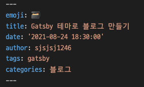

평소 공부하며 깨달은 내용과 프로젝트를 하며 겪는 문제와 해결방법을 정리하고 싶어 블로그를 개설하게 됐습니다.
이 블로그는 Gatsby프레임워크로 개발되었으며 [zoomkoding-gatsby-blog](https://github.com/zoomKoding/zoomkoding-gatsby-blog)테마를 기반으로 커스텀 되었습니다.

첫 포스팅으로 테마를 이용해 블로그를 개설하는 방법을 작성해보겠습니다.

## 1. gatsby로 블로그를 만든 이유

가끔 개발을 하다보면 머리가 깨질 것 같이 아프곤 합니다. 뇌가 새로운 정보를 받아들이길 거부하는 느낌.. 뇌의 용량은 한정적이므로.. 습득한 정보를 압축하고 정리할 필요가 있었습니다.

처음엔 Jekyll을 사용하여 블로그를 만들었습니다. 사실 때깔이 뭐가 중요하겠냐만.. 저는 제 마음대로 블로그를 커스텀해보고 싶었습니다. 하지만 Jekyll은 루비로 작성되어 커스텀하기가 어려웠습니다.

그러다 React 기반의 정적 페이지 개발 프레임워크를 발견했습니다. 평소 리액트를 주력으로 사용하고 있기 때문에 바로 만들어 보기로 했습니다.

> 정적 웹사이트란.. HTML, CSS, JavaScript로만 구성된 웹사이트이며 바로 브라우저를 통해 보여질 수 있는 사이트입니다.
> 반대로 동적 웹사이트는 웹 어플리케이션을 통해 동적으로 생성된 페이지가 브라우저에 전달되어 보여지게 됩니다.
> 동적 웹사이트로 블로그를 만들 경우 따로 웹 어플리케이션을 실행할 서버가 필요하고 그 서버를 배포해야 하니 정적 웹사이트가 배포하기도 쉽고 속도가 빠릅니다.
> React도 npm run build를 통해 정적 파일을 만들수는 있지만 Gatsby에 비해 기능이 많이 없습니다.

## 2. Gatsby 테마 사용하기

Gatsby는 Jekyll과 같은 정적 사이트 개발 프레임워크입니다. 뷰는 React로 구성하고 GraphQL을 통해 데이터를 처리하며 SEO, Lazy-Loading 그외 많은 플러그인들이 있습니다.

### Gatsby 설치

먼저 gatsby를 설치해봅시다.

```bash
npm install -g gatsby-cli
```

### Gatsby 프로젝트 만들기

개츠비는 프로젝트를 생성할 때 테마를 적용할 수 있습니다.

저는 [zoomkoding-gatsby-blog](https://github.com/zoomKoding/zoomkoding-gatsby-blog)테마를 사용했습니다. git clone과 비슷한 것이라고 생각하면 될 것 같습니다.

[이곳](https://www.gatsbyjs.com/starters)에서 더 많은 테마를 볼 수 있습니다. 블로그 뿐만 아니라 다양한 주제의 사이트들이 있습니다.

```bash
gatsby new [프로젝트 이름] [적용할 테마의 주소]
```

## 3. Repository 만들기


먼저 깃허브에 Repogitory를 생성합니다.


그리고 Gatsby 프로젝트 디렉토리에서 위 명령어를 입력해 저장소로 푸쉬합니다.

## 4. Gatsby Blog 커스텀하기

이제 복사해온 사이트의 정보를 자신에게 맞게 수정해주어야 하는데요. 이 부분은 테마 마다 상당히 다를 수 있습니다. 각자 구현한 방식이 다를 수 있기 때문입니다.

### package.json

먼저 프로젝트의 정보를 수정해줍니다.


### gatsby-meta-config.js

Gatsby에서 사용하는 메타 데이터를 수정해줍니다. 테마 마다 다르겠지만 사이트 제목, 썸네일 주소, 깃허브 주소, 이메일, 포트폴리오 등등 기존에 써져있는 데이터를 자신에게 맞게 변경하거나 테마의 repository에 안내된 방법대로 수정해주시면 되겠습니다.


## 5. 포스팅하기

이부분도 테마별로 다르지만 보통 root 디렉토리에 blog 또는 content라는 디렉토리가 있을 겁니다.




그곳에 형식에 맞게, 테마의 안내에 따라 마크다운으로 글을 작성해주시면 됩니다.

## 6. 로컬에서 실행해보기

먼저 로컬에서 잘 작동하는지 실행해봅시다.

```bash
yarn gatsby develop
```

만약 실행했을 때 이미지가 깨져있다거나 오작동이 있을 경우

```bash
yarn gatsby clean
```

위 명령어를 통해 빌드 파일을 지운 후 다시 실행해봅시다.

## 7. Github Pages로 배포하기

이 단계에서 가장 고생을 많이 했습니다. 저는 커스텀 도메인을 적용해야 했기에..

### github-pages 사용하기

```bash
yarn add gh-pages
```

github pages를 프로젝트에 설치해줍니다.

### 커스텀 도메인을 이용하고 싶을 때


DNS 세팅을 위와 같이 해줍니다.


프로젝트 루트에 CNAME이라는 파일을 만들어 주고 커스텀 도메인의 주소를 넣습니다.

Package.json에 다음 명령어를 작성해줍니다.

```json
"scripts": {
	...
	"predeploy": "gatsby build && cp CNAME ./public",
	"deploy": "gh-pages -d public",
	...
}
```

배포해줍시다!

```bash
yarn deploy
```


Enforce HTTPS를 활성화시켜 보안을 강화하세요!

repository settings에서 이런식으로 세팅이 되었다면 성공입니다!

> 배포라는 것이 원래 시간이 좀 걸립니다.. DNS 서버에 전파되는 시간이 걸리기 때문입니다. 그리고 사용자의 브라우저까지 도착하는데에도 시간이 걸리며 오류가 발생한 사이트를 배포했을 경우 그 오류까지 브라우저가 캐싱하여 사이트의 오류를 고쳐 다시 배포한다 해도 즉시 반영되지 않을 수도 있습니다.

### 커스텀 도메인이 없을 때

```json
"predeploy": "gatsby build",
"deploy": "gh-pages -d public",
```


커스텀 도메인이 없을 경우는 깃허브에서 알아서 https://{username}.github.io/{repositoryname}의 주소로 배포될겁니다.

### Github Action을 통한 배포 자동화

블로그 저장소 Secrets에 비밀 키를 하나 만들어줍니다. 키 이름은 ACCESS_TOKEN으로 합니다. 값으로는 깃허브 개발자 설정에서 엑세스 토큰을 하나 만들어야 합니다.


그다음 블로그 저장소에서 Actions탭에 들어가 set up a workflow yourself를 눌러줍니다.


내용에 다음을 적습니다.

```yaml
name: Gatsby Publish
on:
  pull_request:
    branches:
      - main
    paths-ignore:
      - '**/README.md'
  push:
    branches:
      - main
    paths-ignore:
      - '**/README.md'
jobs:
  deploy:
    runs-on: ubuntu-latest
    steps:
      - uses: actions/checkout@v1
      - uses: enriikke/gatsby-gh-pages-action@v2
        with:
          access-token: ${{ secrets.ACCESS_TOKEN }}
          deploy-branch: gh-pages
          skip-publish: false
```

main에 푸쉬하거나 pr이 머지됐을 경우 자동으로 gh-pages를 통해 배포됩니다.

## 8. Netlify로 배포하기

> 처음엔 뭔가 gh-pages를 쓰면 되겠지 하고 썻지만 커스텀 도메인을 사용할 때 gh-pages는 적절하지 않다는 것을 깨달았습니다. 깃허브에서 배포해준 저의 사이트는 닉네임.github.io/저장소이름 입니다. 하지만 저희 도메인 설정은 CNAME으로 닉네임.github.io를 가리키고 있습니다. 그렇다는 것은 추측하건데 깃허브에 nginx같은 WS가 있어서 외부 도메인을 통해 주소 닉네임.github.io으로 왔을 때 닉네임.github.io/저장소이름 으로 리다이렉션 시켜주는 것 같습니다. 그러니 gh-pages로 배포를 할 때마다 사이트가 5분~10분정도 접속이 안되는 것이었습니다.. 저는 gh-pages를 포기하고 netlify를 사용하기로 했습니다.

### 회원가입

[https://netlify.com](https://app.netlify.com/sites/hislogs/settings/deploys) 여기서 회원가입을 합니다.

### netlify CLI 설치

```bash
npm install -g netlify-cli
```

netlify cli를 전역으로 설치해줍니다.

### 배포

편의를 위해 프로젝트 루트에 netlify 배포용 설정파일을 만듭니다.

netlify.toml

```yaml
[build]
  publish = "public"
  command = "npm run build"
[build.environment]
  NODE_VERSION = "14"
  NPM_VERSION = "7.6.0"
```

```bash
yarn build
netlify deploy --prod
```

프로젝트 디렉토리에서 명령어를 실행해줍니다.


콘솔에 안내된대로 배포를 해주면 https://{입력한 사이트 이름}.netlify.app에 배포가 됩니다.

### 도메인 설정


다음과 같이 CNAME을 넷리파이에서 준 주소로 입력합니다.

netlify 사이트로 이동해서 방금 배포한 사이트 설정으로 이동합니다.

Custom domains에 Add custom domain을 누릅니다.


www.도메인이름을 입력하고 Add domain을 누릅니다.


위와 같이 뜬다면 성공했습니다.


또한 아래의 HTTPS에서 인증서를 받을 수 있습니다. 하단 왼쪽의 버튼을 누르세요

### 배포 자동화


Build & deploy 탭에서 배포 설정을 할 수 있습니다.

Link site to Git 버튼을 눌러 저장소와 연동하시고 배포할 branch는 작업하는 branch로 해주세요. 저는 main에 했습니다.

Build Command는 반드시 CI=false npm run build로 해주시고 배포 폴더는 public입니다.

이렇게 설정해두면 main에 푸쉬하거나 pr할 때 자동으로 다시 배포해줍니다.

## 9. 구글 서치 콘솔 등록

[구글서치콘솔](https://search.google.com/search-console/about?hl=ko)에 접속합니다. 소유권을 인증하면 등록이 완료됩니다. 사이트의 데이터를 처리하는 데에 시간이 좀 소요됩니다.

## 10. 구글 애널리틱스 등록

구글 [애널리틱스에](https://analytics.google.com/) 접속합니다.


왼쪽 하단 설정 버튼을 누른 뒤 왼쪽의 계정 만들기를 누릅니다. 계정이름은 마음대로 하셔도 됩니다.

계정을 만든 뒤 오른쪽의 속성에서 데이터 스트림을 만듭니다.

스트림 URL은 사이트의 주소로 합니다. 이제 만들어진 G-로 시작하는 태그를 이용해 사이트와 연결해줄겁니다.

gatsby 플러그인을 설치해야 합니다.

```bash
yarn add gatsby-plugin-gtag
```

gatsby-config.js 에 다음 설정을 추가해줍니다.

```bash
{
      resolve: `gatsby-plugin-gtag`,
      options: {
        trackingId: {발급받은 측정ID},
        head: false,
        anonymize: true,
      },
    },
```

이제 다시 배포하면 사이트의 통계를 볼 수 있습니다.

---
궁금하신 점 있으시면 댓글 달아주세요!

```toc

```
