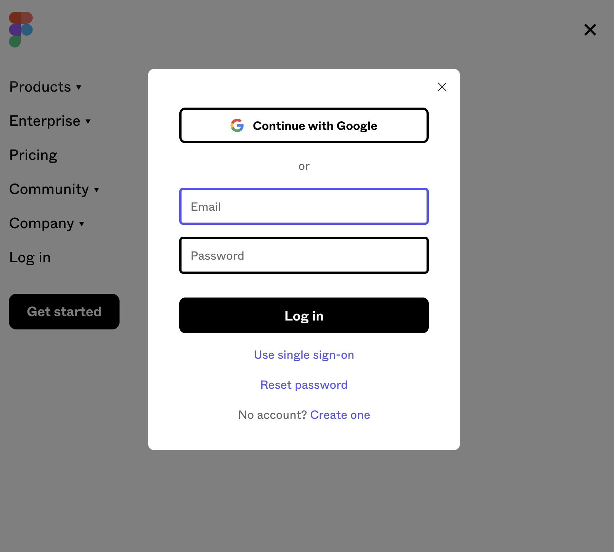
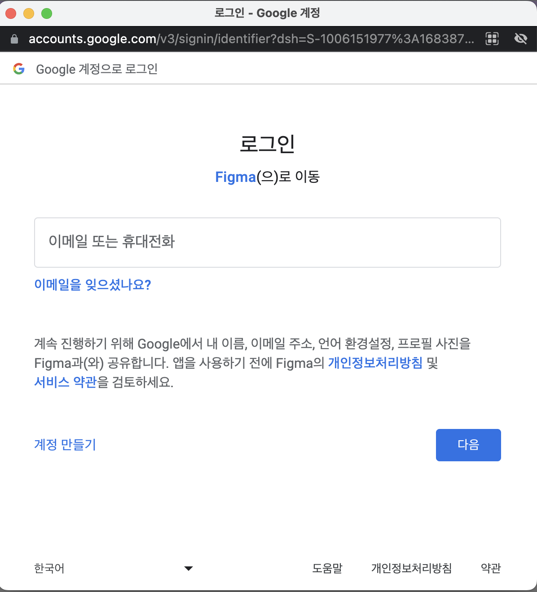
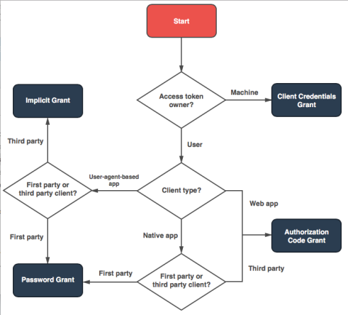
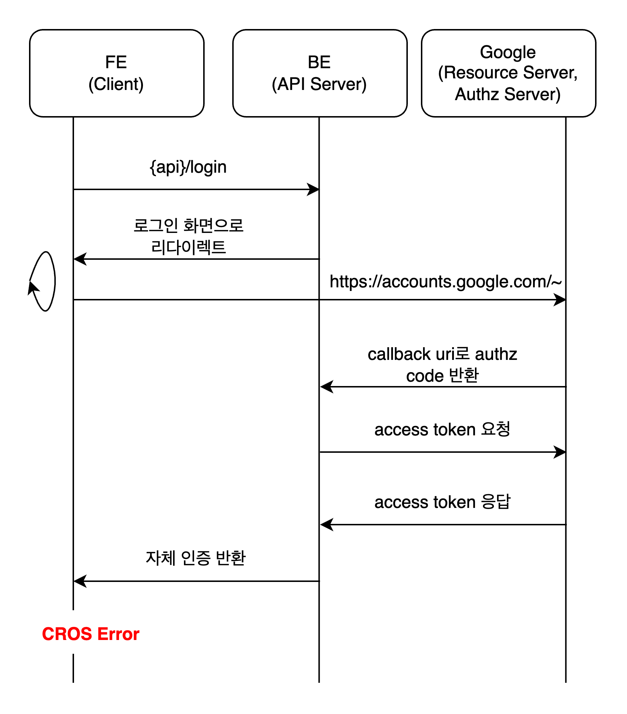
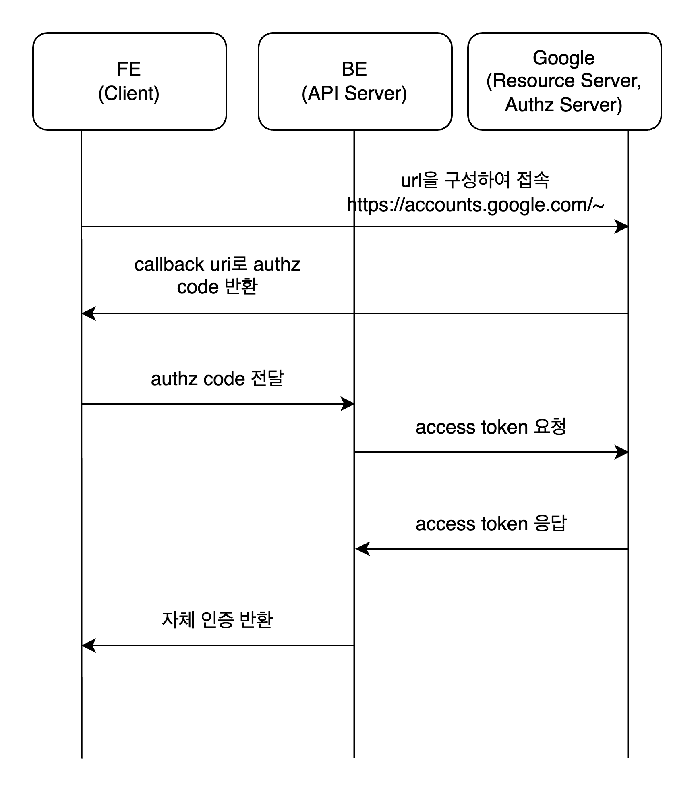
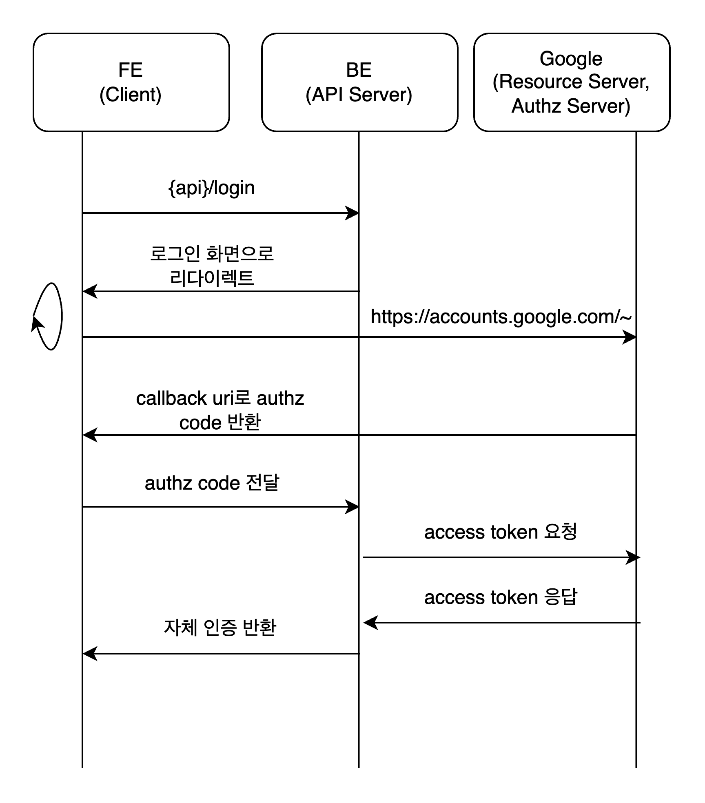

> OAuth는 인터넷 사용자들이 비밀번호를 제공하지 않고 다른 웹사이트 상의 자신들의 정보에 대해 웹사이트나 애플리케이션의 접근 권한을 부여할 수 있는 공통적인 수단으로서 사용되는, 접근 위임을 위한 개방형 표준이다. (위키백과)
> 

**이 글은 RFC 6749 OAuth 2.0 표준을 엄격히 따라 작성합니다.**

## OAuth 2.0

먼저 OAuth 2.0 동작 방식에 대해 살펴봅시다.

우리가 특정 서비스에서 회원가입을 해야 한다고 생각해봅시다. 아이디, 비밀번호 이메일 인증 등등 절대 가볍게 할 수 있는 과정은 아닙니다. 회원 가입 과정에서 이탈하는 유저도 많죠.

이때 OAuth를 이용하면 고객과 서비스 제공자 모두 이점을 얻을 수 있습니다.

- 사용자는 ID, Password를 처음보는 서비스에 넘겨주지 않아도 됨
- 서비스는 관리하기 부답스럽고 방대할 수 있는 사용자의 ID, Password 정보를 보관하고 있지 않아도 됨,

## **OAuth 2.0 참여자**

OAuth 동작에 관여하는 참여자는 크게 세 가지로 구분할 수 있습니다.(OAuth2.0 명세와 정확히 일치하게 작성하였습니다.)

- Authorization Server: Resource Owner를 인증하고 권한을 얻은 후 클라이언트에 액세스 토큰을 발급합니다.
    - Authorization Server와 Resource Server간의 상호 작용은 명세되지 않았습니다. Authorization Server는 Resource Server와 동일한 서버이거나 별도의 엔티티일 수 있습니다.
    - 단일 Authorization Server가 여러 Resource Server에서 허용하는 액세스 토큰을 발급할 수 있습니다.
- Resource Server : 액세스 토큰을 사용하여 보호된 리소스 요청을 수락하고 응답할 수 있는 보호된 리소스를 호스팅하는 서버입니다.
- Resource Owner : 보호된 리소스에 대한 액세스 권한을 부여할 수 있는 엔티티입니다. 리소스 소유자가 사용자인 경우 이를 최종 사용자라고 합니다.
    - Client 서비스를 통해 로그인하려는 유저가 이에 속합니다.
- Client : 리소스 소유자를 대신하여 권한을 부여하여 보호된 리소스를 요청하는 응용 프로그램입니다.
    - 클라이언트라는 용어는 광범위하며 애플리케이션 서버, 웹 애플리케이션 등 다양할 수 있습니다.

## OAuth 2.0 공통 Flow

기본적으로 OAuth 2.0은 다음 과정을 따릅니다.

```
+--------+                               +---------------+
|        |--(A)- Authorization Request ->|   Resource    |
|        |                               |     Owner     |
|        |<-(B)-- Authorization Grant ---|               |
|        |                               +---------------+
|        |
|        |                               +---------------+
|        |--(C)-- Authorization Grant -->| Authorization |
| Client |                               |     Server    |
|        |<-(D)----- Access Token -------|               |
|        |                               +---------------+
|        |
|        |                               +---------------+
|        |--(E)----- Access Token ------>|    Resource   |
|        |                               |     Server    |
|        |<-(F)--- Protected Resource ---|               |
+--------+                               +---------------+

          Figure 1: Abstract Protocol Flow
```

### A 권한 요청

클라이언트가 리소스 소유자에게 권한 부여를 요청합니다. 권한 부여 요청은 리소스 소유자에게 직접(표시된 대로) 수행하거나, 가급적이면 권한 부여 서버를 통해 간접적으로 중개할 수 있습니다.

### B 권한 수신

클라이언트는 리소스 소유자의 권한을 나타내는 자격 증명인 권한 부여를 수신하며, 이는 이 규격에 정의된 네 가지 권한 부여 유형 중 하나 또는 확장 권한 부여 유형을 사용하여 표현됩니다. 

권한 부여 유형은 클라이언트가 권한 부여를 요청하는 데 사용하는 방법과 권한 부여 서버에서 지원하는 유형에 따라 달라집니다.

A, B단계에서 선호되는 권한을 부여받는 과정은 Authorization Server을 매개로 사용하는 것입니다.

### C 엑세스 토큰 요청

클라이언트는 권한 부여 서버로 인증하고 권한 부여를 표시하여 액세스 토큰을 요청합니다

### D 엑세스 토큰 발급

권한 부여 서버는 클라이언트를 인증하고 권한 부여를 확인하며 유효한 경우 액세스 토큰을 발급합니다.

### E 자원 요청

클라이언트는 리소스 서버에서 보호된 리소스를 요청하고 액세스 토큰을 제시하여 인증합니다.

### F 자원 전달

리소스 서버는 액세스 토큰을 검증하고 유효한 경우 요청을 처리합니다.

---

이러한 과정은 RFC 6749 OAuth 2.0 명세에 따른 정석적인 방법입니다. 그러나 그렇기 때문에 처음 보시는 분들은 이해가 잘 안될수도 있을 것 같습니다.

## 실제 예제

많이들 쓰는 Figma를 예로 들어보겠습니다. Figma는 Google OAuth를 지원하고 있습니다. 이때 역할은 다음과 같습니다.

- Authorization Server: 구글의 인증 서버
- Resource Server: 구글의 API 서버
- Resource Owner: (구글 계정이 있는)사용자
- Client: Figma 웹 애플리케이션

### 사전 준비: Client 등록

Client(웹 어플리케이션)가 Resource Server를 이용하기 위해서는 자신의 서비스를 등록함으로써 사전 승인을 받아야 합니다.

사이트의 몇가지 정보를 입력하고 다음 정보를 발급 받습니다.

1. Client ID : 외부 노출 가능한 ID
2. Client Secret : 외부에 노출되면 안되는 비밀 키

이때 redirect URIs라 하여 사용자의 인증이 성공했을 경우 콜백함수로 리다이렉트할 주소를 넘겨야 합니다.

Figma는 이런 과정을 사전에 했을 것입니다.

### A 권한 요청



Figma는 구글 로그인 버튼을 통해 구글 OAuth 인증을 유도합니다.

Figma는 새 창으로 구글 인증 서버에 중개하여 권한 부여를 요청합니다.



```
https://accounts.google.com/v3/signin/identifier?dsh=S-1006151977%3A1683871088497951&access_type=online&client_id={client_id}&o2v=2&prompt=select_account&redirect_uri=https%3A%2F%2Fwww.figma.com%2Ffinish_google_sso&response_type=code&scope=profile+email&service=lso&state=7AiUp0O5iGdn5yU8tJ%2Fu2X4AJT7FaxrqbGWSJkoLTx9o&flowName=GeneralOAuthFlow&continue=https%3A%2F%2Faccounts.google.com%2Fsignin%2Foauth%2Fconsent%3Fauthuser%3Dunknown%26part%3DAJi8hAPRh5ap0lsJdLnhpFKxSD9OpA5rHMaG0AAw5Au8phIQhUoAiWEQnhhvFzPFsVa1J85YYhGFIcv3WMpVEHPJke5o5s3gaSTbVTim33vTFfsFK5vtqi1R1KViLjVXCHj4vf7O3QdxpNKWV9TsGonkMzXkgJaXzXJ3sMJ1L0gE5JjHzFBap32Kc2AmQtkyexEZKC2NT7We_KeKkmyaU3eLzB2na_HTzNvzF8DocJbB7K0fNlcOufpv8EXGr9uTLedL38-nljWH9h5ZdYkhgusj9p28mY-8FZ6IVKsaruDGipm9mwZZPxp-i2wNH-gFWRKunOxF0X7gZQ1J9flSqvR-sHYsltoiWBH_2Y4fCijogtqiM8sq9juJ0lMeQn3m7-3W9OO9OwPvT7gI_brGDXBEH8HceFQtM4qTAs6HURVjPG-ojhndxJBO1pkBotG0hgUAPdqY2CtqJI99stPd70S3rmGYt-4yfg%26as%3DS-1006151977%253A1683871088497951%26client_id%3D532352704633-6pkces9iboppp465idnovkcqtlsa8j7t.apps.googleusercontent.com%23&app_domain=https%3A%2F%2Fwww.figma.com&rart=ANgoxcfPA_FJ6_gFPWl4wergbx_ZpQtfOLXCA_Qf4KD7tjQvcFySdT_ACHKXMcQg6VDpkHDkWDWUjnfqGjwfrTNi1KLpQpWv9Q
```

위의 주소로 권한 부여 요청을 보냈으며 구글에서는 로그인 화면을 응답으로 창에 보여주고 있습니다.

redirect_uri가 [https://www.figma.com/finish_google_sso](https://www.figma.com/finish_google_sso)로 설정되어 있는 것이 눈에 띕니다.

### B 권한 수신

구글 로그인을 마치면 구글에서는 cliend_id, secret_key, redirect_uri가 승인된 목록에 있는지 등을 확인하여 redirect_uri로 Authorization Code(권한을 부여받았다는 확인 코드)를 포함하여 보냅니다. 

새 창에서는 이 코드를 받고 부모(초기 Figma 화면)에 넘깁니다.

### C 엑세스 토큰 요청

부모 페이지에서는 Authorization Code를 가지고 google에 AccessToken을 요청합니다.

### D 엑세스 토큰 발급

client_id, secret_key authorizationCode등을 조합하여 유효할 경우 accessToken을 발급받습니다.

### E 자원 요청

Figma는 access_token을 통해 google에 정보를 요청합니다

### F 자원 전달

구글 유저의 ID를 받아옵니다.

신규 유저라면 Figma DB에 새 유저를 등록합니다. 그 이후에는 피그마의 인증 방식을 따릅니다.

figma.session이라는 쿠키가 존재하는 것을 보니 아마 세션 인증방식을 따르는 것 같습니다.

---

Figma와 같은 방식이 현재 많이들 쓰는 보편적인 방식이라고 보면 되나 세부적인 진행 과정은 서비스마다 다를 수는 있습니다.

## ****Refresh Token****

그러나 Access Token을 무한정 쓰는 것은 너무 위험할 것입니다. 따라서 만료 기간이 있는데 이 만료될 때마다 유저는 다시 로그인을 해야 하니 번거로울 것입니다.

보통 AccessToken을 발급받으면 Refresh Token을 함께 발급합니다. 이를 이용하여 AccessToken이 만료되어 401 Status를 받았을 때 Refresh Token으로 Access Token을 재발급 받아 사용하면 사용자가 다시 로그인하지 않아도 됩니다.

```
+--------+                                           +---------------+
|        |--(A)------- Authorization Grant --------->|               |
|        |                                           |               |
|        |<-(B)----------- Access Token -------------|               |
|        |               & Refresh Token             |               |
|        |                                           |               |
|        |                            +----------+   |               |
|        |--(C)---- Access Token ---->|          |   |               |
|        |                            |          |   |               |
|        |<-(D)- Protected Resource --| Resource |   | Authorization |
| Client |                            |  Server  |   |     Server    |
|        |--(E)---- Access Token ---->|          |   |               |
|        |                            |          |   |               |
|        |<-(F)- Invalid Token Error -|          |   |               |
|        |                            +----------+   |               |
|        |                                           |               |
|        |--(G)----------- Refresh Token ----------->|               |
|        |                                           |               |
|        |<-(H)----------- Access Token -------------|               |
+--------+           & Optional Refresh Token        +---------------+

           Figure 2: Refreshing an Expired Access Token
```

기존과 크게 다르지 않습니다. 다른 부분만 다시 보겠습니다.

### B. Access Token과 Refresh Token을 같이 받는다.

### F. Access Token이 만료되어 자원에 접근할 수 없다 (401 Error)

### G. Refresh Token을 통해 Access Token 재발급 요청

### H. 새로운 Acces Token과 Refresh Token(선택) 발급

## OAuth 2.0의 4가지 인증 방식

사실 RFC 명세에는 4가지의 인증 방식을 제시하고 있습니다. 우리가 위에서 봤던 도표는 이 4가지 방식을 추상화 하여 표현한 것이며 세부적으로 다음 방식들이 있습니다.

원문

*An authorization grant is a credential representing the resource owner's authorization (to access its protected resources) used by the client to obtain an access token. This specification defines four grant types -- **authorization code**, **implicit**, **resource owner password credentials**, and **client credentials** -- as well as an extensibility mechanism for defining additional types.*

아래부터 나오는 내용은 딥하니 주의하시길 바라겠습니다..

### Authorization Code Grant

위에서 보았던 Figma가 사용한 Google OAuth 서비스는 Authorization Code Grant 방식을 따른 것입니다. 이 외에도 대부분의 OAuth 제공 업체가 Authorization Code Grant 방식을 따르는 것으로 알고 있습니다.

*Authorization Code Grant 방식은 액세스 토큰과 새로 고침 토큰을 모두 가져오는 데 사용됩니다.*

*이것은 리디렉션 기반 흐름이므로 클라이언트는 리소스 소유자의 사용자 에이전트(일반적으로 웹 브라우저)와 상호 작용할 수 있어야 하며 권한 부여 서버로부터 수신 요청(리다이렉션을 통해)을 수신할 수 있어야 합니다.*

*권한 부여 코드는 권한 부여 서버를 클라이언트와 리소스 소유자 사이의 중개자로 사용하여 가져옵니다. 클라이언트는 리소스 소유자에게 직접 권한 부여를 요청하는 대신 ([RFC2616]에 정의된 사용자-에이전트를 통해) 권한 부여 서버로 리소스 소유자를 이동시키고, 이 서버는 다시 권한 부여 코드를 사용하여 리소스 소유자를 클라이언트로 이동시킵니다.*

*권한 부여 서버는 권한 부여 코드를 사용하여 리소스 소유자를 클라이언트에 다시 전달하기 전에 리소스 소유자를 인증하고 권한을 얻습니다. 리소스 소유자는 인증 서버로만 인증되므로 **리소스 소유자의 인증 정보는 클라이언트와 공유되지 않습니다.***

*권한 부여 코드는 클라이언트 인증 기능뿐만 아니라 **액세스 토큰을 리소스 소유자의 사용자 에이전트를 통과하지 않고 클라이언트에 직접 전송**하여 리소스 소유자를 비롯한 다른 사람에게 노출시킬 수 있는 몇 가지 중요한 **보안 이점을 제공합니다.***

```
+----------+
| Resource |
|   Owner  |
|          |
+----------+
     ^
     |
    (B)
+----|-----+          Client Identifier      +---------------+
|         -+----(A)-- & Redirection URI ---->|               |
|  User-   |                                 | Authorization |
|  Agent  -+----(B)-- User authenticates --->|     Server    |
|          |                                 |               |
|         -+----(C)-- Authorization Code ---<|               |
+-|----|---+                                 +---------------+
  |    |                                         ^      v
 (A)  (C)                                        |      |
  |    |                                         |      |
  ^    v                                         |      |
+---------+                                      |      |
|         |>---(D)-- Authorization Code ---------'      |
|  Client |          & Redirection URI                  |
|         |                                             |
|         |<---(E)----- Access Token -------------------'
+---------+       (w/ Optional Refresh Token)

Note: The lines illustrating steps (A), (B), and (C) are broken into
two parts as they pass through the user-agent.

              Figure 3: Authorization Code Flow
```

#### A. 인증 시작

클라이언트는 리소스 소유자의 사용자 에이전트를 Autorization Endpoint로 지정하여 흐름을 시작합니다. 클라이언트에는 client_id, requested scope, local state, redirection URI가 포함됩니다.

ex) Figma의 경우 새 창을 띄움으로써 그 창을 Authorization Endpoint로 지정하였으며 그 창을 기반으로 계속해서 OAuth 인증 흐름을 다룹니다.

#### B. 권한 요청

권한 부여 서버는 사용자 에이전트를 통해 리소스 소유자를 인증하고 리소스 소유자가 클라이언트의 액세스 요청을 허용할지 여부를 설정합니다.

ex) 새 창에는 구글 로그인 화면이 등장했으며 로그인을 하면 어느 범위까지 허용할지 확인하는 창이 나옵니다.

#### C. 권한 부여

리소스 소유자가 액세스 권한을 부여하는 경우 권한 부여 서버는 이전에 제공된 리디렉션 URI(요청 또는 클라이언트 등록 중)를 사용하여 사용자 에이전트를 클라이언트로 다시 리디렉션합니다. 리디렉션 URI에는 인증 코드와 클라이언트가 이전에 제공한 모든 로컬 상태가 포함됩니다.

ex) 구글은 [https://www.figma.com/finish_google_sso](https://www.figma.com/finish_google_sso)로 새창을 redirect 해주었습니다. 새 창은 그 코드를 부모 페이지(초기 Figma 페이지)에 전달해주며 인증이 완료됐다는 것을 알립니다.

#### D. Access Token 요청

클라이언트는 이전 단계에서 받은 인증 코드를 포함하여 인증 서버의 토큰 끝점에서 액세스 토큰을 요청합니다. 요청을 할 때 클라이언트는 권한 부여 서버로 인증합니다. 클라이언트에는 확인을 위한 승인 코드를 가져오는 데 사용되는 리디렉션 URI가 포함되어 있습니다.

ex) 피그마 페이지에서는 authorization code를 가지고 구글에 access token을 요청합니다.

#### E. Access Token 과 Refresh Token(선택) 발급

권한 부여 서버는 클라이언트를 인증하고, 권한 부여 코드를 확인하며, 수신된 리디렉션 URI가 단계(C)에서 클라이언트를 리디렉션하는 데 사용되는 URI와 일치하는지 확인합니다. 유효한 경우 권한 부여 서버는 액세스 토큰과 선택적으로 새로 고침 토큰으로 응답합니다.

ex) 피그마 페이지에서 access token을 발급받고 google api를 통해 구글 유저 ID를 받고 피그마에 등록된 유저인지 확인합니다.

### Implicit Grant

암시적 허용 유형은 액세스 토큰을 가져오는 데 사용되며(새로 고침 토큰 발급을 지원하지 않음) 특정 리디렉션 URI를 작동하는 것으로 알려진 공용 클라이언트에 최적화되어 있습니다. 이러한 클라이언트는 일반적으로 JavaScript와 같은 스크립트 언어를 사용하여 브라우저에서 구현됩니다.

이것은 리디렉션 기반 흐름이므로 클라이언트는 리소스 소유자의 사용자 에이전트(일반적으로 웹 브라우저)와 상호 작용할 수 있어야 하며 권한 부여 서버로부터 수신 요청(리다이렉션을 통해)을 수신할 수 있어야 합니다.

*암묵적 허가는 JavaScript와 같은 스크립트 언어를 사용하여 브라우저에서 구현된 클라이언트에 최적화된 단순화된 권한 부여 코드 흐름입니다. 암묵적 흐름에서 클라이언트는 권한 부여 코드를 발급하는 대신 리소스 소유자 권한 부여의 결과로 액세스 토큰을 직접 발급받습니다. 권한 부여 코드와 같은 중간 자격 증명이 발급되지 않고 나중에 액세스 토큰을 얻는 데 사용되므로 허용 유형은 암시적입니다.*

*암시적 허가 **흐름 중에 액세스 토큰을 발급할 때 권한 부여 서버는 클라이언트를 인증하지 않습니다**. 경우에 따라 액세스 토큰을 클라이언트에 전달하는 데 사용되는 리디렉션 URI를 통해 클라이언트 ID를 확인할 수 있습니다. 액세스 토큰은 리소스 소유자의 사용자 에이전트에 대한 액세스 권한을 가진 리소스 소유자 또는 **다른 응용 프로그램에 노출될 수 있습니다.***

***암묵적 허가는 액세스 토큰을 얻는 데 필요한 왕복 횟수를 줄이기 때문에 일부 클라이언트(예: 브라우저 내 애플리케이션으로 구현된 클라이언트)의 응답성과 효율성을 향상시킵니다.** 그러나 이러한 편리성은 특히 승인 코드 허가 유형이 사용 가능한 경우 암묵적 허가를 사용할 때의 보안 영향과 비교해야 합니다.*

```
+----------+
| Resource |
|  Owner   |
|          |
+----------+
     ^
     |
    (B)
+----|-----+          Client Identifier     +---------------+
|         -+----(A)-- & Redirection URI --->|               |
|  User-   |                                | Authorization |
|  Agent  -|----(B)-- User authenticates -->|     Server    |
|          |                                |               |
|          |<---(C)--- Redirection URI ----<|               |
|          |          with Access Token     +---------------+
|          |            in Fragment
|          |                                +---------------+
|          |----(D)--- Redirection URI ---->|   Web-Hosted  |
|          |          without Fragment      |     Client    |
|          |                                |    Resource   |
|     (F)  |<---(E)------- Script ---------<|               |
|          |                                +---------------+
+-|--------+
  |    |
 (A)  (G) Access Token
  |    |
  ^    v
+---------+
|         |
|  Client |
|         |
+---------+

Note: The lines illustrating steps (A) and (B) are broken into two
   parts as they pass through the user-agent.

                       Figure 4: Implicit Grant Flow
```

#### A. 인증 시작

클라이언트는 리소스 소유자의 사용자 에이전트를 Autorization Endpoint로 지정하여 흐름을 시작합니다. 클라이언트에는 client_id, requested scope, local state, redirection URI가 포함됩니다.

#### B. 권한 요청

권한 부여 서버는 사용자 에이전트를 통해 리소스 소유자를 인증하고 리소스 소유자가 클라이언트의 액세스 요청을 허용할지 여부를 설정합니다.

#### C. Access Token이 포함된 URI로 redirection

리소스 소유자가 액세스 권한을 부여하면 권한 부여 서버는 이전에 제공한 리디렉션 URI를 사용하여 사용자 에이전트를 클라이언트로 다시 리디렉션합니다.  리디렉션 URI는 URI Fragment에 액세스 토큰을 포함합니다.

#### D. Client Resource URI로 redirection

사용자 에이전트는 웹 호스팅된 클라이언트 리소스에 요청하여 리디렉션 지시사항을 따릅니다. 사용자 에이전트는 Fragment 정보를 로컬로 유지합니다.

#### E. 스크립트 반환

웹 호스팅된 클라이언트 리소스는 사용자 에이전트가 보유한 조각을 포함한 전체 리디렉션 URI에 액세스하고 조각에 포함된 액세스 토큰(및 기타 매개 변수)을 추출할 수 있는 웹 페이지(일반적으로 내장된 스크립트가 있는 HTML 문서)를 반환합니다.

#### F. 스크립트 실행

사용자 에이전트는 액세스 토큰을 추출하는 웹 호스팅 클라이언트 리소스에서 제공한 스크립트를 로컬로 실행합니다.

#### G. Access Token 전달

사용자 에이전트가 액세스 토큰을 클라이언트에 전달합니다.

### Resource Owner Password Credentials Grant

리소스 소유자 암호 인증 정보 부여 유형은 장치 운영 체제 또는 권한이 높은 응용 프로그램과 같이 리소스 소유자가 클라이언트와 신뢰 관계를 맺고 있는 경우에 적합합니다. 권한 부여 서버는 이 허용 유형을 사용하도록 설정할 때 특히 주의해야 하며 다른 흐름을 사용할 수 없는 경우에만 허용해야 합니다.

이 권한 부여 유형은 리소스 소유자의 자격 증명(일반적으로 대화형 양식을 사용하는 사용자 이름 및 암호)을 가져올 수 있는 클라이언트에 적합합니다. 또한 저장된 자격 증명을 액세스 토큰으로 변환하여 HTTP Basic 또는 Digest 인증과 같은 직접 인증 체계를 사용하여 기존 클라이언트를 OAuth로 마이그레이션하는 데 사용됩니다.

*리소스 소유자 암호 자격 증명(예: 사용자 이름 및 암호)을 권한 부여로 직접 사용하여 액세스 토큰을 얻을 수 있습니다. 자격 증명은 리소스 소유자와 클라이언트 사이에 높은 신뢰도(예: 클라이언트가 장치 운영 체제의 일부이거나 권한이 매우 높은 응용 프로그램임) 다른 권한 부여 유형(예: 권한 부여 코드)을 사용할 수 없는 경우에만 사용해야 합니다.*

*이 허가 유형을 사용하려면 리소스 소유자 자격 증명에 대한 직접 클라이언트 액세스가 필요하지만 리소스 소유자 자격 증명은 단일 요청에 사용되며 액세스 토큰으로 교환됩니다. 이 허가 유형을 사용하면 자격 증명을 수명이 긴 액세스 토큰 또는 새로 고침 토큰과 교환하여 나중에 사용할 수 있도록 클라이언트가 리소스 소유자 자격 증명을 저장할 필요가 없습니다.*

```
+----------+
| Resource |
|  Owner   |
|          |
+----------+
     v
     |    Resource Owner
    (A) Password Credentials
     |
     v
+---------+                                  +---------------+
|         |>--(B)---- Resource Owner ------->|               |
|         |         Password Credentials     | Authorization |
| Client  |                                  |     Server    |
|         |<--(C)---- Access Token ---------<|               |
|         |    (w/ Optional Refresh Token)   |               |
+---------+                                  +---------------+

     Figure 5: Resource Owner Password Credentials Flow
```

#### A. 클라이언트에 인증 정보 전달

리소스 소유자는 클라이언트에 사용자 이름과 암호를 제공합니다.

#### B. 권한 요청

클라이언트는 리소스 소유자로부터 받은 자격 증명을 포함하여 권한 부여 서버의 토큰 endpoint에서 액세스 토큰을 요청합니다.

#### C. Access Token 발급

권한 부여 서버는 클라이언트를 인증하고 리소스 소유자 자격 증명을 확인하며 유효한 경우 액세스 토큰을 발급합니다.

### Client Credentials Grant

클라이언트가 자신의 제어 하에 있는 보호된 리소스에 대한 액세스를 요청할 때 클라이언트는 클라이언트 자격 증명(또는 지원되는 다른 인증 수단)만을 사용하여 액세스 토큰을 요청할 수 있습니다, 또는 이전에 권한 부여 서버와 함께 배치된 다른 리소스 소유자의 경우(이 사양의 범위를 벗어나는 방법). 클라이언트 자격 증명 부여 유형은 기밀 클라이언트에서만 사용해야 합니다.

*권한 부여 범위가 클라이언트가 제어하는 보호된 리소스 또는 이전에 권한 부여 서버와 함께 배열된 보호된 리소스로 제한되는 경우 클라이언트 자격 증명(또는 다른 형식의 클라이언트 인증)을 권한 부여로 사용할 수 있습니다. 클라이언트 자격 증명은 일반적으로 클라이언트가 자체적으로 작업하거나(클라이언트가 리소스 소유자이기도 함) 권한 부여 서버와 함께 이전에 설정된 권한 부여에 따라 보호된 리소스에 대한 액세스를 요청할 때 권한 부여로 사용됩니다.*

```
+---------+                                  +---------------+
|         |                                  |               |
|         |>--(A)- Client Authentication --->| Authorization |
| Client  |                                  |     Server    |
|         |<--(B)---- Access Token ---------<|               |
|         |                                  |               |
+---------+                                  +---------------+

           Figure 6: Client Credentials Flow
```

#### A. 권한 요청

클라이언트는 인증 서버로 인증하고 token endpoint에서 액세스 토큰을 요청합니다.

#### B. Access Token 발급

권한 부여 서버는 클라이언트를 인증하고 유효한 경우 액세스 토큰을 발급합니다.

## 무엇을 선택해야 할까?

다음은 4가지 인증 방식 중 선택하는 가이드입니다.



[https://alexbilbie.com/guide-to-oauth-2-grants/](https://alexbilbie.com/guide-to-oauth-2-grants/)

그러나 보안상의 이유로 Implicit, Password Grant는 권장되지 않으며 현재는 거의 사용되지 않는 방식입니다.

## 필자의 경험

### OAuth를 구현하려다 CORS 에러가 났다..

당시 에러를 겪었던 프로젝트입니다.

[https://github.com/sjsjsj1246/todo_list_for_react_seminar](https://github.com/sjsjsj1246/todo_list_for_react_seminar)

당시 백엔드 개발자분과 머리를 맞대고 고민한 결과로 만들어낸 OAuth 인증 Flow입니다.



그러나 저는 무슨 시도를 하던간에 브라우저에서 CORS 에러를 보게 되었습니다..

당시 CORS가 뭔지도 모르고 OAuth 인증 방식도 전혀 몰랐기 때문에 별짓을 다 했던 기억이 있군요..

CORS 에러를 얻게 된 이유는 다음과 같습니다.

FE에서 BE로

- 클라이언트가 서버에 로그인 요청
- 서버는 기관에 리다이렉트
- callback url이 서버로 설정, 기관에서 서버에 Authorization Code 전달
- 서버는 Authorization Code와 secret Key등을 통해 Access Token 획득
- 서버는 유저 정보 조회 후 클라이언트에 인증 정보 보냄
- 이때 클라이언트는 기관에 요청했으나 서버에서 응답이 왔으므로 SOP를 위반하였고 Access-Controll-Allow_Origin 헤더에 우리 서비스가 있을리 만무하니 CORS 에러가 발생합니다.

당시 임시방편으로 [https://cors-anywhere.herokuapp.com](https://cors-anywhere.herokuapp.com/)라는 프록시 서버를 통하여 CORS 에러를 우회하였습니다. 

리다이렉트를 [https://cors-anywhere.herokuapp.com](https://cors-anywhere.herokuapp.com/)/`https://google.com/~~~` 이런식으로 하면 저 프록시 서버가 요청을 대신 해주고 응답을 돌려줍니다.. 간단히 쓸만한 친구이긴 한 것 같습니다만 아무래도 올바른 방법은 아닌 것 같죠?

시간이 지나 저는 RFC OAuth2 표준과 여러 사례들을 조사했고 google OAuth는 Authorization Code Grant 방식을 따른다는 것을 알게 되었습니다.

원리를 자세히 알고 보니 그냥 클라이언트에서 직접 기관에 인증을 요청하고 시작하는 것이 깔끔한 것 같았습니다.

다음과 같은 대안을 생각했습니다.

1. Client에서 바로 구글 인증 허가받기



1. 기존 flow에서 callback을 Client로 설정하기



당시 프로젝트에서는 2번 대안을 선택했습니다.

- 클라이언트가 서버에 로그인 요청
- 서버는 기관에 리다이렉트
- callback url이 client로 설정, 기관에서 client에 엑세스 전달
- client는 서버에 Authorization Code 전달
- 서버는 Authorization Code와 secret Key등을 통해 Access Token 획득
- 서버는 유저 정보 조회 후 클라이언트에 인증 정보 보냄

---

CORS에 대해서는 다음 글을 참고해주세요!

[CORS란 무엇인가? (그만 괴롭혀..)](https://hislogs.com/cors/)

## 현재는?

OAuth 2.0 표준을 처음 냈을 때와는 달리 스마트폰 사용이 대중화되고 등장하는 다양한 문제에 대응하기 위해 추가적인 OAuth 방식이 등장했습니다.

### PKCE

RFC 7636에 정의된 방식입니다.

[https://datatracker.ietf.org/doc/html/rfc7636#section-6.2](https://datatracker.ietf.org/doc/html/rfc7636#section-6.2)

#### 등장 배경

```
+~~~~~~~~~~~~~~~~~~~~~~~~~~~~~~~~+
| End Device (e.g., Smartphone)  |
|                                |
| +-------------+   +----------+ | (6) Access Token  +----------+
| |Legitimate   |   | Malicious|<--------------------|          |
| |OAuth 2.0 App|   | App      |-------------------->|          |
| +-------------+   +----------+ | (5) Authorization |          |
|        |    ^          ^       |        Grant      |          |
|        |     \         |       |                   |          |
|        |      \   (4)  |       |                   |          |
|    (1) |       \  Authz|       |                   |          |
|   Authz|        \ Code |       |                   |  Authz   |
| Request|         \     |       |                   |  Server  |
|        |          \    |       |                   |          |
|        |           \   |       |                   |          |
|        v            \  |       |                   |          |
| +----------------------------+ |                   |          |
| |                            | | (3) Authz Code    |          |
| |     Operating System/      |<--------------------|          |
| |         Browser            |-------------------->|          |
| |                            | | (2) Authz Request |          |
| +----------------------------+ |                   +----------+
+~~~~~~~~~~~~~~~~~~~~~~~~~~~~~~~~+
         Figure 1: Authorization Code Interception Attack
```

1. 악의적인 앱이 깔려있는 스마트폰 디바이스가 Client ID와 Client Secret을 탈취합니다.
2. 악의적인 앱은 OS에서 Http 정보를 탈취합니다.
    1. Authorization Code를 알아냅니다.
    2. Authorization endpoint를 알아냅니다.
3. 악의적인 앱이 Authorization Server에 탈취한 내용을 바탕으로 Access Token을 얻어냅니다.

#### 동작 방식

PKCE는 Authorization Code Grant의 확장된 방식입니다.

```
                                          +-------------------+
                                          |   Authz Server    |
+--------+                                | +---------------+ |
|        |--(A)- Authorization Request ---->|               | |
|        |       + t(code_verifier), t_m  | | Authorization | |
|        |                                | |    Endpoint   | |
|        |<-(B)---- Authorization Code -----|               | |
|        |                                | +---------------+ |
| Client |                                |                   |
|        |                                | +---------------+ |
|        |--(C)-- Access Token Request ---->|               | |
|        |          + code_verifier       | |    Token      | |
|        |                                | |   Endpoint    | |
|        |<-(D)------ Access Token ---------|               | |
+--------+                                | +---------------+ |
                                          +-------------------+
              Figure 2: Abstract Protocol Flow
```

#### A. 기존 권한 요구에서 code_challenge를 함께 보낸다.

클라이언트는 "code_verifier"라는 이름의 암호를 생성 및 기록하고 변환된 버전 `t(code_verifier)`(`code_challenge`라고도 함)를 파생하며, 변환 방법 `t_m`과 함께 OAuth 2.0 Authorization Request에 전송됩니다.

#### B. Authorization Code 발급

Authorization Endpoint는 정상적으로 응답하지만 `t(code_verifier)`와 변환 방법을 기록합니다.

#### C. Access Token 요청

그런 다음 클라이언트는 액세스 토큰 요청에 평소와 같이 인증 코드를 보내지만 (A)에서 생성된 `code_verifier` 비밀을 포함합니다.

#### D. Access Token 발급

인증 서버는 `code_verifier`를 변환하여 (B)의 `t(code_verifier)`와 비교합니다. 동일하지 않으면 액세스가 거부됩니다.

B에서 인증 코드를 가로채는 공격자는 "code_verifier" 암호를 소유하고 있지 않기 때문에 액세스 토큰에 대해 인증 코드를 사용할 수 없습니다.

실제로는 다음과 같이 보냅니다.

A단계에서 code_challenge와 code_challenge_method를 보낸 모습입니다.

```xml
https://authorization-server.com/authorize?
  response_type=code
  &client_id={client_id}
  &redirect_uri=https://www.oauth.com/playground/authorization-code-with-pkce.html
  &scope=photo+offline_access
  &state=w7pneFNa8aF2i5f_
  &code_challenge=7C24F3815BE1AC517F474EBD9B1D97FDC478E210C8E57A9AADDC5DD189C865D6
  &code_challenge_method=S256
```

C단계에서 code_verifier를 보냅니다. 이는 클라이언트만 알고 있던 값이고 여기에 Sha256해시 함수를 적용하면 처음에 보냈던 code_challenge가 나와야 유효할 것입니다.

```xml
POST https://authorization-server.com/token

grant_type=authorization_code
&client_id={client_id}
&client_secret={client_secret}
&redirect_uri=https://www.oauth.com/playground/authorization-code-with-pkce.html
&code=Uyz9EU-QeRfW4Kt-nUnq4s7NxMuFjJLhT3DVHD6VyLn8Mc5Q
&code_verifier=D5183FEBAAE48A3D1B4A2AC2BA40823E9474B930C3F9C40D10C3812279CACB52
```

### Device Code

RFC 8628에 정의된 방식입니다.

비슷하게 모바일 환경에서 OAuth 2.0을 수행하기 위해 등장한 방식입니다.

[RFC ft-ietf-oauth-device-flow: OAuth 2.0 Device Authorization Grant](https://datatracker.ietf.org/doc/html/rfc8628#section-3.4)

#### 동작 방식

```
+----------+                                +----------------+
|          |>---(A)-- Client Identifier --->|                |
|          |                                |                |
|          |<---(B)-- Device Code,      ---<|                |
|          |          User Code,            |                |
|  Device  |          & Verification URI    |                |
|  Client  |                                |                |
|          |  [polling]                     |                |
|          |>---(E)-- Device Code       --->|                |
|          |          & Client Identifier   |                |
|          |                                |  Authorization |
|          |<---(F)-- Access Token      ---<|     Server     |
+----------+   (& Optional Refresh Token)   |                |
      v                                     |                |
      :                                     |                |
     (C) User Code & Verification URI       |                |
      :                                     |                |
      v                                     |                |
+----------+                                |                |
| End User |                                |                |
|    at    |<---(D)-- End user reviews  --->|                |
|  Browser |          authorization request |                |
+----------+                                +----------------+

              Figure 1: Device Authorization Flow
```

#### A. 권한 요청  

클라이언트는 권한 부여 서버에서 액세스를 요청하고 요청에 클라이언트 식별자를 포함합니다.

#### B. 확인 URI 전달

 권한 부여 서버는 장치 코드와 User Code를 발급하고 최종 사용자 확인 URI를 제공합니다.

#### C. URI 이동 지시

클라이언트는 최종 사용자에게 다른 장치에서 사용자 에이전트를 사용하고 제공된 최종 사용자 확인 URI를 방문하도록 지시합니다.  

클라이언트는 권한 부여 요청을 검토하기 위해 입력할 User Code를 사용자에게 제공합니다.

#### D. User Code 입력, 권한 리뷰

권한 부여 서버는 사용자 에이전트를 통해 최종 사용자를 인증하고 장치 클라이언트에서 제공하는 사용자 코드를 입력하라는 메시지를 표시합니다.  권한 부여 서버는 사용자가 제공한 사용자 코드를 확인하고 사용자에게 요청을 수락 또는 거절할지 묻는 메시지를 표시합니다.

#### E. Access Token 요청 polling

최종 사용자가 클라이언트의 요청을 검토하는 동안(단계 D) 클라이언트는 권한 부여 서버를 반복적으로 폴링하여 사용자가 사용자 권한 부여 단계를 완료했는지 여부를 폴링합니다.  클라이언트에는 장치 코드와 해당 클라이언트 식별자가 포함됩니다.

#### F. Access Token 발급

권한 부여 서버는 클라이언트에서 제공한 장치 코드를 확인하고 클라이언트가 액세스 권한을 부여받으면 액세스 토큰으로 응답합니다. 액세스가 거부되면 오류가 발생하거나 클라이언트가 계속 폴링해야 한다는 표시가 나타납니다.

## OAuth 1.0과 OAuth 2.0의 차이?

OAuth 2.0은 기존의 OAuth 1.0와 호환되지 않는 새로운 프로토콜입니다.

기존의 OAuth 1.0은 데스크톱이나 휴대폰 애플리케이션에서 사용자가 원하는 서비스로 브라우저를 연 뒤 서비스를 인증하고, 서비스에서 애플리케이션으로 토큰을 복사하여 사용하는 방식이었습니다.
브라우저를 왔다갔다하는 과정이 필수적이었어서 사용자 경험 측면에서 나쁘다는 비판을 받았으며. OAuth 2.0이 나타나며 이러한 **인증 절차가 간소화** 되었으며 몇가지 **용어가 변경**되었습니다.

| 특징 | OAuth 1.0 | OAuth 2.0 |
| --- | --- | --- |
| 역할 | 이용자(User) | - 자원 소유자(Resource Owner) |
|  | 소비자(Consumer) | - 클라이언트(Client) |
|  | 서비스 제공자(Service Provider) | - 자원 서버(Resource Server)- 권한 서버(Authorization Server) |
| API 호출 인증 및 보안 | 서명 | - HTTPS(SSL/TLS) 기본 지원.
- 여러 인증 방식을 통해 다양한 시나리오에 대응 가능.
- Access Token의 Life Time을 지원하여 만료일 설정 가능. |
| 클라이언트 지원 유형 | 웹 애플리케이션 | - 다양한 플랫폼 지원 |
| Access Token | Access Token 발급시계속 사용 가능. | - 보안 강화를 위해 Access Token의 Life-time을 지정 가능. |

## 참고자료

RFC 6749: https://datatracker.ietf.org/doc/html/rfc6749

OAuth Community Site: https://oauth.net

OAuth 2.0 Playground: https://www.oauth.com/playground/authorization-code-with-pkce.html

추후 작업 예정

- OIDC(OpenID Connect)


```toc

```