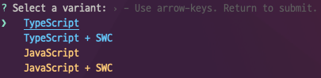
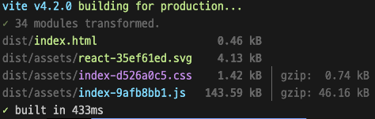

다음과 같은 명령어로 바로 프로젝트를 생성할 수 있습니다.

```bash
npm create vite 프로젝트명
```

의존성 설치 과정이 없어서 빠르게 프로젝트를 생성해줍니다.

또한 그렇기 때문에 pnpm이나 yarn등 원하는 패키지 매니저로 관리할 수 있겠습니다.




원하는 템플릿 선택하시면 되겠습니다.

버전 4.3.1 기준

생성 직후 package.json입니다.

```json
{
  "name": "프로젝트명",
  "private": true,
  "version": "0.0.0",
  "type": "module",
  "scripts": {
    "dev": "vite",
    "build": "tsc && vite build",
    "lint": "eslint src --ext ts,tsx --report-unused-disable-directives --max-warnings 0",
    "preview": "vite preview"
  },
  "dependencies": {
    "react": "^18.2.0",
    "react-dom": "^18.2.0"
  },
  "devDependencies": {
    "@types/react": "^18.0.28",
    "@types/react-dom": "^18.0.11",
    "@typescript-eslint/eslint-plugin": "^5.57.1",
    "@typescript-eslint/parser": "^5.57.1",
    "@vitejs/plugin-react-swc": "^3.0.0",
    "eslint": "^8.38.0",
    "eslint-plugin-react-hooks": "^4.6.0",
    "eslint-plugin-react-refresh": "^0.3.4",
    "typescript": "^5.0.2",
    "vite": "^4.3.0"
  }
}
```

- vite와 @vitejs/plugin-react-swc 라는 의존성이 눈에 띕니다.

vite.config.ts

```tsx
import { defineConfig } from 'vite'
import react from '@vitejs/plugin-react-swc'

// https://vitejs.dev/config/
export default defineConfig({
  plugins: [react()],
})
```

config 파일이 ts로 되어있어 Definition을 찾아보며 작성할 수 있어 좋은 것 같습니다.

swc를 사용하는 플러그인이 적용된 것을 볼 수 있습니다.

build시간이 말도안되게 빠릅니다.



이제 create-react-app은 놔줘야 할 떄가 된 것 같습니다

---

그리고 CRA에 대해 다음 자료를 읽어보시면 좋을 것 같습니다.

[(번역) ‘Create React App 권장을 Vite로 대체’ PR 대한 Dan Abramov의 답변](https://junghan92.medium.com/번역-create-react-app-권장을-vite로-대체-pr-대한-dan-abramov의-답변-3050b5678ac8)

```toc

```